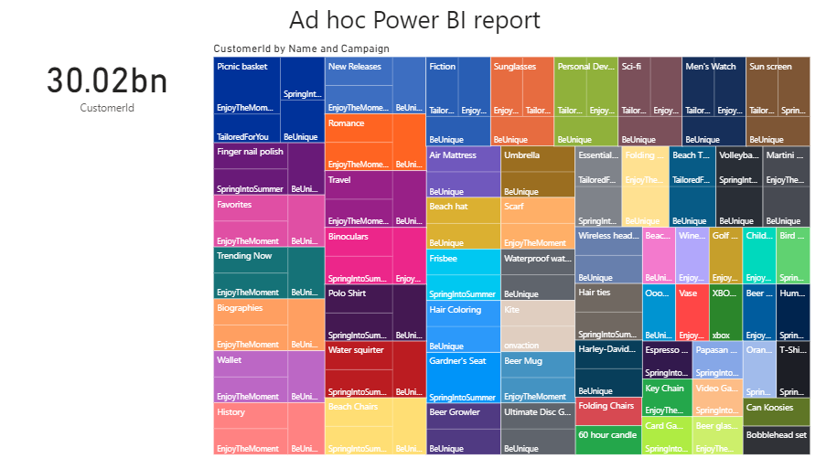
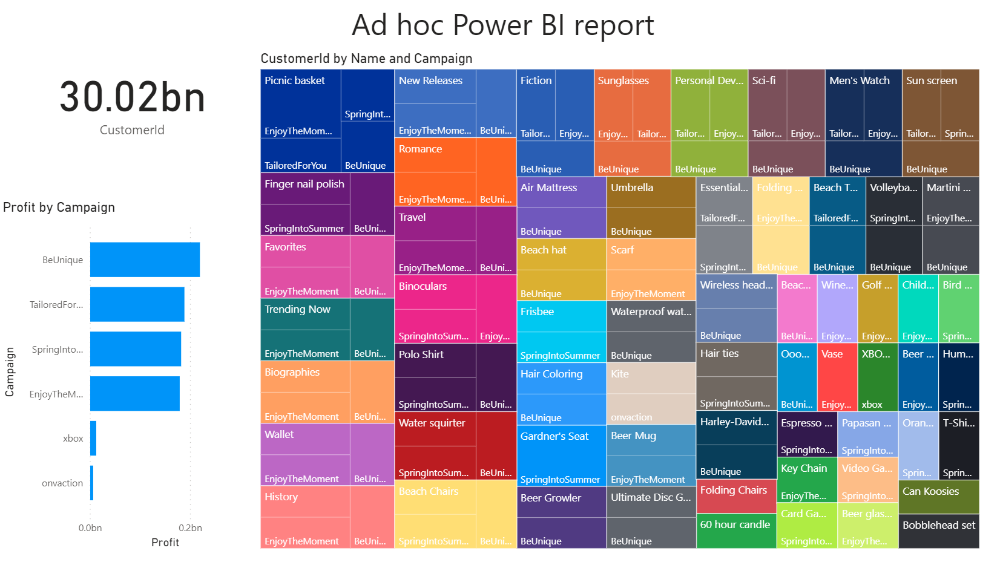

### Ad Hoc Reporting in Azure Synapse Analytics (Optional)

1. From the "Develop" hub, "Power BI" section **Select** "2. Billion Rows Demo" Power BI report.

2. **Select** the empty area in the report canvas. Next, from the Fields list **Select** or **Drag and Drop** "CustomerId" from "wwi AllSales" table to the report canvas.

3. From the Visualizations pane **select** the card visual. **Resize and move** the card visual to see what is shown in screenshot.

4. **Select** the empty area in the report canvas. From the Fields list **Select** or **Drag and Drop** "CustomerId" from "wwi AllSales" table to the report canvas. [Pointer 1 from the screenshot]. Then **Select** "Name" field from the "Products" table [Pointer 2 from the screenshot]. Then **Select** "Campaign" field from the "ProdChamp" table [Pointer 3 from the screenshot]. From the Visualizations pane select the Treemap icon [Pointer 4 from the screenshot].

5.	**Resize and move** the card visual as shown in the screenshot.

6.	**Select** an empty area in the report canvas.Then **Select** the "Campaign" field from the "ProdChamp" table [Pointer 1 from the screenshot]. Then **Select** "Profit" field from the "wwi AllSales" table [Pointer 2 from the screenshot]. Finally, from the Visualizations pane select the Bar Chart icon [Pointer 3 from the screenshot].

7.	**Resize and move** the card visual as shown in the screenshot. 

8.	**Hover** over save button, but **do NOT** save.

**TODO** Report was already prepared when launched for the first time.