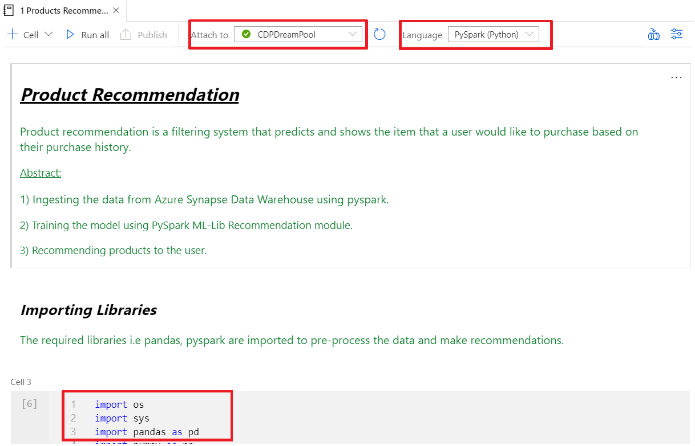
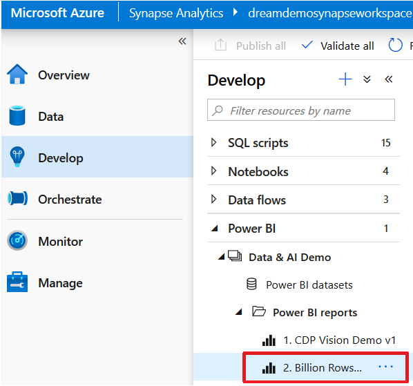

# Azure Synapse Analytics

## Pitch the awesomeness of Synapse

## Data Orchestration and Ingestion

### Data Ingestion

1. On the Synapse Overview page **Select** Ingest and then observe already created linked services.

2. In the Copy data dialog **Select** next.

3. **Select** ‘Create new connection’

4. **Show/highlight** available data providers.

### Orchestrate Hub and Data Pipelines

1. **Select** “Orchestrate”

2. **Select/Expand** “Pipelines” and then **Select** “SAP HANA TO ADLS” pipeline.

#### Migrate SAP Hana to Azure Synapse Analytics

3. From the editor window **Select** copy data activity. Then **select** ‘Source’ property of the copy data activity to see the Source Dataset and observe that the query is pulling data from SAP Hana

4. With copy data selected, **Select** the ‘Sink’ property of the copy data activity. Look at the Sink dataset, in this case; you are saving to ADLS Gen2 storage container.

5. **Select** Mapping Data Flow activity and then **select** Settings. Next **select** "Open" to go to Data Flow editor.

6. In Data Flow editor **observe** the flow. Look in detail into each activity using the following steps.

7.	In the **first activity**, we are selecting data from the Data Lake staging area.
8.	In the **second activity**, we are filtering data for the last 5 years.

9.	In the **third activity**, we are deriving columns from a Column Order Date.

10.	In the **fourth activity**, we are only selecting the required columns from the table.
11. In the **fifth activity**, we are creating an aggregated Total Sales grouped by Year and Month.
12. In the **sixth activity**, we load the aggregated table to Azure Synapse.

20. In the **seventh activity**, we are taking a parallel route by selecting all the remaining rows and writing the full table to Azure Synapse.

21. To view all the available transformations in the data flow editor, **select** the + (add action), which is to the right of the first activity.

22.	**Scroll down** to see the full list of transformations at different levels.

#### Code First Experience: Migrate Teradata to Azure Synapse Analytics

1. In the Orchestrate hub, **select** ‘MarketingDBMigration’ from the list of pipelines.

**Note:** This pipeline is for demonstration purposes only. __Do NOT execute__ the pipeline.

2. **Select** lookup activity, then **select** Settings to observe the Source dataset property (Teradata).

3. **Select** "Copy data" activity and observe Source and Sink properties.

4. **Select** "Prep data in Azure Synapse" Notebook, then **select** "Settings". Once you are in the settings tab, **select** "Open" to open the notebook

5.	**Show** the Python code. This is the code first experience in Synapse analytics.

#### Migrate last five years of sales transactional data from Oracle to Azure Synapse Analytics

1. **Select** “SalesDBMigration” from the Orchestrate hub.

2. **Select** “Lookup”
3. **Point** out “OracleSalesDB” field in Source Dataset field
4. **Select** Copy data

5. Hover over various pipelines in the orchestrate tab.

#### Moving semi-structured data to Azure Synapse Analytics

1. **Select** "TwitterDataMigration" from the list of pipelines.

2. Look at the “Copy data”, “Archive Tweets data in ADLS Gen2” and “Clean up the archived Twitter Data” activities. 

### On Demand Query: Azure Data Lake Gen2

1. **Select** "Data" Hub from the left navigation in the Synapse Analytics workspace. From the Data blade, under Storage accounts, **Select/expand** "dreamdemostorageforgen2". **Observe** various data sources (including CI) that are now in ADL Gen2 and then **Select** ‘twitterdata’ storage container.

2. **See** all the parquet files and other folders in the twitterdata container. **Select** the first two parquet files and **right Click**, from the context menu, Select ‘New SQL Script’

3. **Select** run.

4. **Select** Chart

5. **Minimize** the storage accounts on the left side, then **expand** the "Databases" tree, expand "AzureSynapseDW (SQL pool)", and finally expand "Tables" folder.

#### COPY INTO Command

1. **Select** Develop, then **expand** SQL Scripts to list all available scripts. **Select** “8 External Data to Synapse Via Copy Into” and **highlight** the query presented below titled "Step:1".

2. **Select** Run and observe the “No results found” message.

3.	**Scroll** to the bottom and **select** "COPY INTO" query below "Step:2" as shown in the screenshot. Finally, **select** "Run"

## Develop Hub

1. **Select** Develop in the various tabs available in the Develop hub workspace and discover the environment. 

2. **Select** “Develop” and then **select** “1 SQL Query with Synapse”

3. **Select** "AzureSynapseDW" SQL Pool from the "Connect to" drop down menu. Once the "Use database" drop dows is populated **Select** "AzureSynapseDW" database from the "Use Database" drop down. Finally, **Select** the below query (#3 in the screenshot)

`SELECT COUNT_BIG(1) as TotalCount  FROM wwi.Sales(nolock)`

4. **Select** "Run" and observe the results (30 Billion). **Scroll down** a few lines to the second query, **select** the query as shown in the screenshot, and then **Select** "Run".  **Observe** time the query takes – query time is listed at the bottom of the screenshot.

5. **Select** the "chart" button, and then **select** chart type dropdown to **see** various chart types 

### JSON Extractor Differentiator and other optional differentiator “snackable” pocket demos

1. **Select** "Develop", and then **Select** "2 JSON Extractor". Next, from the "Connect to" dropdown **Connect** To "AzureSynapseDW" SQL Pool. **Select** the query as shown in the screenshot and **Select** "Run".

2. **Observe** the results of query 

### Using Notebooks to Run Machine Learning Experiments

1. Select the develop hub from the Synapse workspace. Next, **Select** and expand the "Notebooks" option.

2. **Select** the "1. Product Recommendations" notebook, which will open the notebook.

3. Once the notebook is open, **select** “CDP DreamPool” from the "Attach to" dropdown. CDP DreamPool is a Spark Pool. **Select** PySpark from the “Language” dropdown list.

4. **Expand** “Language” and see supported languages.

5. **Observe** the import statements in the Notebook 

6. **Observe** the results in the notebook under "Map Products".

**See** code in cell 26, but **DO NOT** execute any code.

#### AutoML in Azure Synapse Analytics 

1. **Select** "Develop" from the Synapse workspace

2. **Expand** Notebooks section and **Select** "2 AutoML Customer Forecasting" Notebook.

3. **Scroll down** to see the content in the screenshot.

4. **Scroll down** to observe the content in the screenshot.

5. **Scroll down** to see the code in cell 35.

6. Scroll down to see cell 42.

### Power BI reporting within the Synapse Analytics workspace

1. **Select** "Develop" from the Synapse workspace and **Expand** the Power BI section. Next, **expand** "Data & AI Demo" (which is a Power BI workspace) and **expand** Power BI reports. Finally, **select** "1. CDP Vision Demo" Power BI report. This will open the decomposition tree.

2. Once the report is open, in the "Decomposition Tree Analysis" tab **see** Store Visits by Campaign then by Region. **Select** "+" next to North & Central America 

3. **Select** QnA tab 

4.	In the Q&A box, **type** "profit by country by product category as treemap"

### Ad Hoc Reporting in Azure Synapse Analytics (Optional)

1. From the "Develop" hub, "Power BI" section **Select** "2. Billion Rows Demo" Power BI report.

2. **Select** the empty area in the report canvas. Next, from the Fields list **Select** or **Drag and Drop** "CustomerId" from "wwi AllSales" table to the report canvas.

3. From the Visualizations pane **select** the card visual. **Resize and move** the card visual to see what is shown in screenshot.

4. **Select** the empty area in the report canvas. From the Fields list **Select** or **Drag and Drop** "CustomerId" from "wwi AllSales" table to the report canvas. [Pointer 1 from the screenshot]. Then **Select** "Name" field from the "Products" table [Pointer 2 from the screenshot]. Then **Select** "Campaign" field from the "ProdChamp" table [Pointer 3 from the screenshot]. From the Visualizations pane select the Treemap icon [Pointer 4 from the screenshot].

5.	**Resize and move** the card visual as shown in the screenshot.

6.	**Select** an empty area in the report canvas.Then **Select** the "Campaign" field from the "ProdChamp" table [Pointer 1 from the screenshot]. Then **Select** "Profit" field from the "wwi AllSales" table [Pointer 2 from the screenshot]. Finally, from the Visualizations pane select the Bar Chart icon [Pointer 3 from the screenshot].

7.	**Resize and move** the card visual as shown in the screenshot. 

8.	**Hover** over save button, but **do NOT** save.
