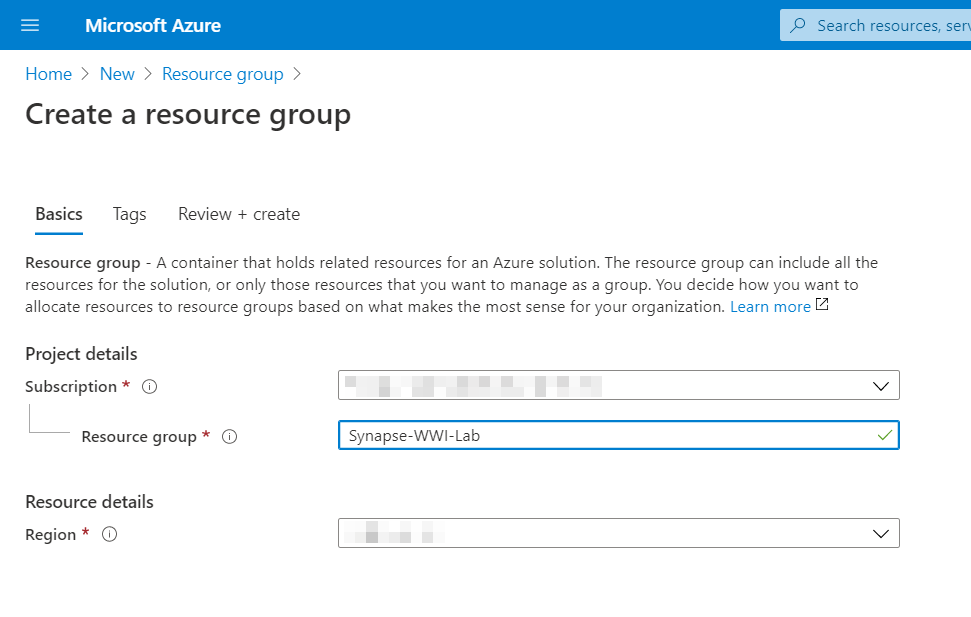
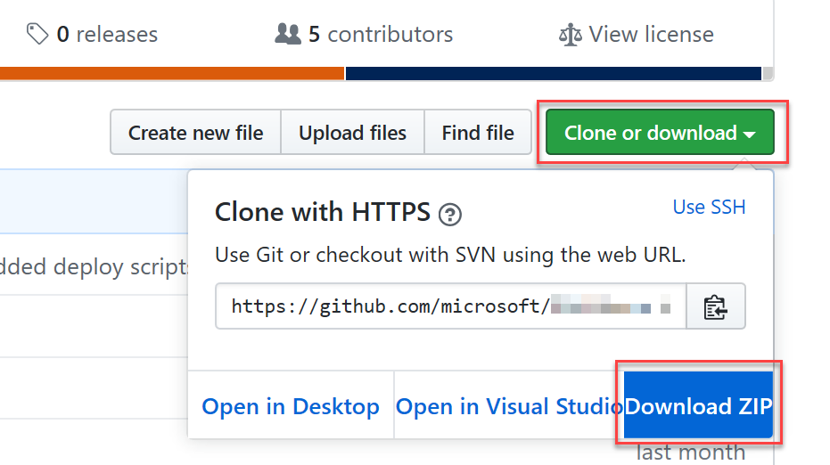
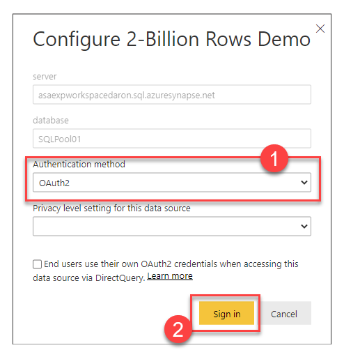

<div class="MCWHeader1">
Azure Synapse Analytics Wide World Importers (WWI) Demo, Lab and POC
</div>

<div class="MCWHeader2">
Before the hands-on lab setup guide
</div>

<div class="MCWHeader3">
May 2020
</div>

Information in this document, including URL and other Internet Web site references, is subject to change without notice. Unless otherwise noted, the example companies, organizations, products, domain names, e-mail addresses, logos, people, places, and events depicted herein are fictitious, and no association with any real company, organization, product, domain name, e-mail address, logo, person, place or event is intended or should be inferred. Complying with all applicable copyright laws is the responsibility of the user. Without limiting the rights under copyright, no part of this document may be reproduced, stored in or introduced into a retrieval system, or transmitted in any form or by any means (electronic, mechanical, photocopying, recording, or otherwise), or for any purpose, without the express written permission of Microsoft Corporation.

Microsoft may have patents, patent applications, trademarks, copyrights, or other intellectual property rights covering subject matter in this document. Except as expressly provided in any written license agreement from Microsoft, the furnishing of this document does not give you any license to these patents, trademarks, copyrights, or other intellectual property.

The names of manufacturers, products, or URLs are provided for informational purposes only and Microsoft makes no representations and warranties, either expressed, implied, or statutory, regarding these manufacturers or the use of the products with any Microsoft technologies. The inclusion of a manufacturer or product does not imply endorsement of Microsoft of the manufacturer or product. Links may be provided to third party sites. Such sites are not under the control of Microsoft and Microsoft is not responsible for the contents of any linked site or any link contained in a linked site, or any changes or updates to such sites. Microsoft is not responsible for webcasting or any other form of transmission received from any linked site. Microsoft is providing these links to you only as a convenience, and the inclusion of any link does not imply endorsement of Microsoft of the site or the products contained therein.

© 2020 Microsoft Corporation. All rights reserved.

Microsoft and the trademarks listed at <https://www.microsoft.com/en-us/legal/intellectualproperty/Trademarks/Usage/General.aspx> are trademarks of the Microsoft group of companies. All other trademarks are property of their respective owners.

**Contents**

<!-- TOC -->

- [Azure Synapse Analytics end-to-end solution before the hands-on lab setup guide](#azure-synapse-analytics-end-to-end-solution-before-the-hands-on-lab-setup-guide)
  - [Requirements](#requirements)
  - [Before the hands-on lab](#before-the-hands-on-lab)
    - [Task 1: Create a resource group in Azure](#task-1-create-a-resource-group-in-azure)
    - [Task 2: Create Azure Synapse Analytics workspace](#task-2-create-azure-synapse-analytics-workspace)
    - [Task 3: Download lab artifacts](#task-3-download-lab-artifacts)
    - [Task 4: Create a local settings file](#task-4-create-a-local-settings-file)
    - [Task 5: Run environment setup PowerShell scripts](#task-5-run-environment-setup-powershell-scripts)

<!-- /TOC -->

# Azure Synapse Analytics WWI lab setup guide

## Requirements

1. An Azure Account with the ability to create an Azure Synapse Workspace
2. A PowerBI Pro or Premium account to host Power BI reports.

## Before the hands-on lab

### Task 1: Create a resource group in Azure

1. Log into the [Azure Portal](https://portal.azure.com) using your Azure credentials.

2. On the Azure Portal home screen, select the **+ Create a resource** tile.

    

3. In the **Search the Marketplace** text box, type **Resource group** and press the **Enter** key.

    

4. Select the **Create** button on the **Resource group** overview page.

5. On the **Create a resource group** screen, select your desired Subscription and Region. For Resource group, enter **Synapse-WWI-Lab**, then select the **Review + Create** button.

    

6. Select the **Create** button once validation has passed.

### Task 2: Create Azure Synapse Analytics workspace

1. Deploy the workspace through the following Azure ARM template (press the button below):

    <a href="https://portal.azure.com/#create/Microsoft.Template/uri/https%3A%2F%2Fraw.githubusercontent.com%2Fsolliancenet%2Fazure-synapse-wwi-lab%2Fmaster%2Fartifacts%2Fenvironment-setup%2Fautomation%2F00-asa-workspace-core.json%3Ftoken%3DAAWYR62FS2TMH3GYFSFQE2263X2AM" target="_blank"></a>

2. On the **Custom deployment** form, select your desired subscription and select **Synapse-WWI-Lab** for the **Resource group**. Also provide a **Unique Suffix**. Finally, provide a strong **SQL Administrator Login Password**. Remember this password value, you'll be needing it!

    
  
    > **Important**: The `location` field under 'Settings' will list the Azure regions where Azure Synapse Analytics (Preview) is available as of June 2020. This will help you find a region where the service is available without being limited to where the resource group is defined.

3. Check the **I agree to the terms and conditions stated above**, then select the **Purchase** button. The provisioning of your deployment resources will take approximately 10 minutes.

    > **Note**: You may experience a deployment step failing in regards to Role Assignment. This error may safely be ignored.

### Task 3: Download lab artifacts

1. In a web browser, navigate to the [MCW Azure Synapse Analytics WWI Lab repository](https://github.com/microsoft/azure-synapse-wwi-lab).

2. Expand the **Clone or download** button, and select **Download Zip**.

    

3. Extract the downloaded zip file to the location of your choice.

### Task 4: Create a local settings file

1. On your local machine, create a folder **C:\LabFiles**. Inside this folder, create a new file named **AzureCreds.ps1**. In this file, you will set parameters necessary to complete the workspace setup.

    ```PowerShell
    $AzureUserName = "<enter your azure username>"
    $AzurePassword = "<enter your azure password>"
    $TokenGeneratorClientId = "1950a258-227b-4e31-a9cf-717495945fc2"
    $AzureSQLPassword = "<enter the same password you chose when deploying the workspace>"
    $Load30Billion = 0
    ```

When the `$Load30Billion` variable is set to `1` the script will scale your SQLPool to `DW3000c` and populate the database with 30 billion records that will be used as part of exercise during the lab. The approx load time for the data set is 4 hours. When the variable is left at 0 the total data size will be 3 million records.

### Task 5: Run environment setup PowerShell scripts

1. Open **Visual Studio Code** and open the folder to where you extracted the lab files (extracted in Task 3). **Be sure to run this application as Administrator**.

2. Open **artifacts/environment-setup/automation/01-environment-setup.ps1**.

3. Open a Terminal Window (ctrl + shift + `). Ensure **PowerShell** or **PowerShell Integrated Console** is selected on the Terminal pane toolbar.

    

4. Change the directory to the **automation** folder.

    ```PowerShell
    cd '.\artifacts\environment-setup\automation'
    ```

5. In the editor window, select the entire script (ctrl + a), then right-click and select **Run selection** _OR_ you may press **F8** to run the selection.

    

    > **Note**: if you see an error regarding `No modules were removed` or `Uninstall-AzureRm`, it is safe to ignore. If the script pauses for prompts, enter the `A` (Yes to All) option.

    > **Note**: if you experience script failures, it may be beneficial to highlight only the lines preceding the `$InformationPreference = "Continue"` line and run them separately from the rest of the script. Some people have experienced the console not stopping for user input when importing from the PowerShell Gallery.

6. Open **artifacts/environment-setup/automation/02-powerbi-setup.ps1**. 

7. Get a new Powershell terminal by selecting the **+** button in Visual Studio's Terminal window.


8. Repeat step 5 for the current **02-powerbi-setup.ps1** file and execute it.

7. Sign in into the [Power BI Portal](https://powerbi.microsoft.com/en-us/) using your Azure credentials. 

8. From the hamburger menu select **Workspaces** to access the list of workspaces available to you. Select the workspace named `ASA-EXP`.


8. Select the **Settings** icon from the top right bar, and select **Settings** again to navigate to the settings page. 


9. Select **datasets** tab to access the list of datasets available. Then select `2-Billion Rows Demo` dataset to access its settings. From the settings page open **Data source credentials** and select **Edit credentials**.


9. Select **OAuth2** for the **Authentication method** and select **Sign In** to complete the process.



You should follow all steps provided *before* performing the Hands-on lab.