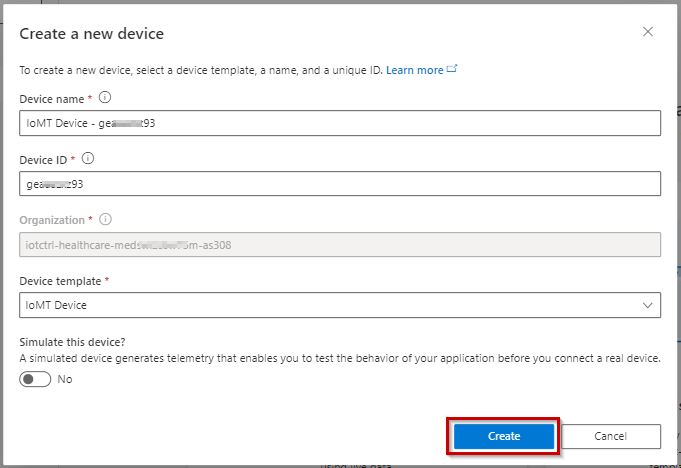
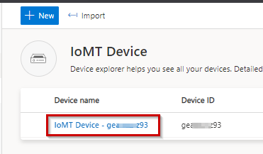
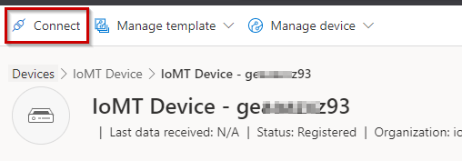
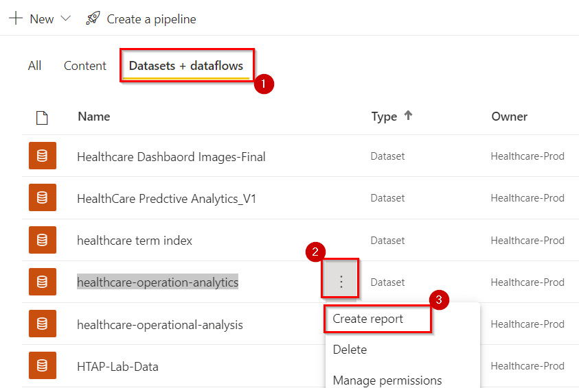
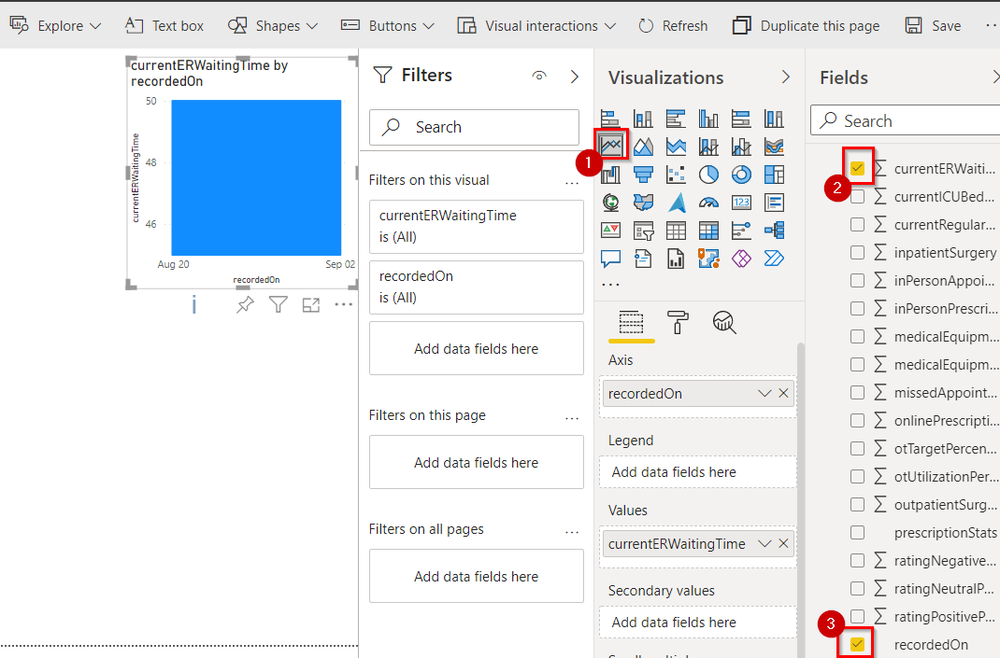
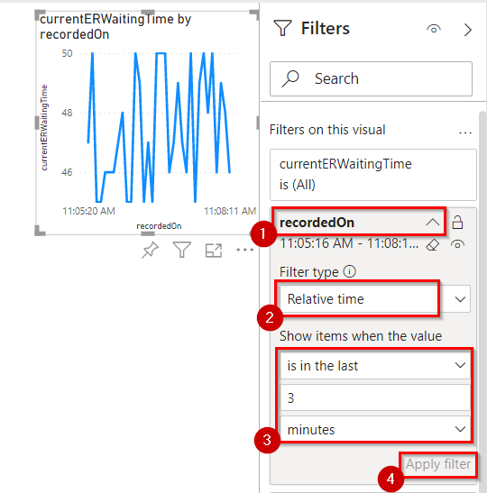
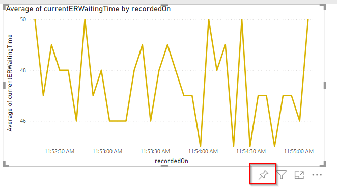
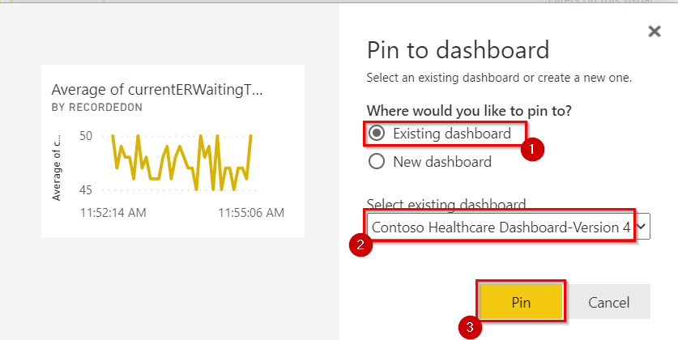

# HealthCare DREAM Demo in a Box Setup Guide

## What is it?
DREAM Demos in a Box (DDiB) are packaged Industry Scenario DREAM Demos with ARM templates (with a demo web app, Power BI reports, Synapse resources, AML Notebooks etc.) that can be deployed in a customer’s subscription using the CAPE tool in a few hours.  Partners can also deploy DREAM Demos in their own subscriptions using DDiB.

 ## Objective & Intent
Partners can deploy DREAM Demos in their own Azure subscriptions and show live demos to customers. 
In partnership with Microsoft sellers, partners can deploy the Industry scenario DREAM demos into customer subscriptions. 
Customers can play,  get hands-on experience navigating through the demo environment in their own subscription and show to their own stakeholders
**Before You Begin**

## :exclamation:IMPORTANT NOTES:  

  1.  DREAM Demo in a Box (DDiB) can be deployed by partners in their own Azure Subscriptions. **Partners can deploy DDiB in customer's subscription ONLY through the CAPE process. CAPE** tool is accessible by Microsoft employees. For more information about **CAPE** process, please connect with your Local Data & AI Specialist or CSA/GBB.
  2.  **Please go through the [license agreement](https://github.com/microsoft/Azure-Analytics-and-AI-Engagement/blob/main/CDP-Retail/license.md) and [disclaimer](https://github.com/microsoft/Azure-Analytics-and-AI-Engagement/blob/main/CDP-Retail/disclaimer.md) before proceeding.**
  3. Please note that **Azure hosting costs** are involved when DREAM Demos in a Box are implemented in customer or partner Azure subscriptions. **Microsoft will not cover** DDiB hosting costs for partners or customers.
  4. Since this is a DDiB, there are certain resources open to the public. **Please ensure proper security practices are followed before you add any sensitive data into the environment.** To strengthen the security posture of the environment, **leverage Azure Security Centre.** 
  5.  For any questions or comments please email **[dreamdemos@microsoft.com](mailto:dreamdemos@microsoft.com).**
  
   > **Note**: Set up your demo environment at least two hours before your scheduled demo to make sure everything is working.
   
# Copyright

© 2021 Microsoft Corporation. All rights reserved.   

By using this demo/lab, you agree to the following terms: 

The technology/functionality described in this demo/lab is provided by Microsoft Corporation for purposes of obtaining your feedback and to provide you with a learning experience. You may only use the demo/lab to evaluate such technology features and functionality and provide feedback to Microsoft.  You may not use it for any other purpose. You may not modify, copy, distribute, transmit, display, perform, reproduce, publish, license, create derivative works from, transfer, or sell this demo/lab or any portion thereof. 

COPYING OR REPRODUCTION OF THE DEMO/LAB (OR ANY PORTION OF IT) TO ANY OTHER SERVER OR LOCATION FOR FURTHER REPRODUCTION OR REDISTRIBUTION IS EXPRESSLY PROHIBITED. 

THIS DEMO/LAB PROVIDES CERTAIN SOFTWARE TECHNOLOGY/PRODUCT FEATURES AND FUNCTIONALITY, INCLUDING POTENTIAL NEW FEATURES AND CONCEPTS, IN A SIMULATED ENVIRONMENT WITHOUT COMPLEX SET-UP OR INSTALLATION FOR THE PURPOSE DESCRIBED ABOVE. THE TECHNOLOGY/CONCEPTS REPRESENTED IN THIS DEMO/LAB MAY NOT REPRESENT FULL FEATURE FUNCTIONALITY AND MAY NOT WORK THE WAY A FINAL VERSION MAY WORK. WE ALSO MAY NOT RELEASE A FINAL VERSION OF SUCH FEATURES OR CONCEPTS.  YOUR EXPERIENCE WITH USING SUCH FEATURES AND FUNCITONALITY IN A PHYSICAL ENVIRONMENT MAY ALSO BE DIFFERENT. 

## Contents

<!-- TOC -->

- [Azure Synapse Analytics HealthCare setup guide](#azure-synapse-analytics-wwi-setup-guide)
  - [Requirements](#requirements)
  - [Before Starting](#before-starting)
    - [Task 1: Create a resource group in Azure](#task-1-create-a-resource-group-in-azure)
    - [Task 2: Create Power BI workspace](#task-2-create-power-bi-workspace)
    - [Task 3: Deploy the ARM Template](#task-3-deploy-the-arm-template)
    - [Task 4: Provision IoT central devices](#task-4-provision-iot-central-devices)
    - [Task 5: Run the Cloud Shell](#task-5-run-the-cloud-shell)
    - [Task 6: Starting high speed data generators and function apps](#task-6-starting-high-speed-data-generators-and-function-apps)
    - [Task 7: Create Power BI reports and Dashboard](#task-7-create-power-bi-reports-and-dashboard)
    - [Task 8: Creating Synapse Views](#task-8-creating-synapse-views)
    - [Task 9: Publishing the Custom Vision model](#task-9-publishing-the-custom-vision-model)
    - [Task 10: Pause-Resume resources](#task-10-pause-resume-resources)
    - [Task 11: Clean up resources](#task-11-clean-up-resources)
    
<!-- /TOC -->

## Requirements

* An Azure Account with the ability to create an Azure Synapse Workspace.
* A Power BI Pro or Premium account to host Power BI reports.
* Make sure the following resource providers are registered with your Azure Subscription.
   
   - Microsoft.Sql 
   - Microsoft.Synapse 
   - Microsoft.StreamAnalytics 
   - Microsoft.EventHub 
* Please note that you can run only one deployment at a given point of time and need to wait for the completion. You should not run multiple deployments in parallel as that will cause deployment failures.
* Please ensure selection of correct region where desired Azure Services are available. In case certain services are not available, deployment may fail. [Azure Services Global Availability](https://azure.microsoft.com/en-us/global-infrastructure/services/?products=all) for understanding target services availablity.
* Do not use any special characters or uppercase letters in the environment code.
* Please ensure that you select the correct resource group name. We have given a sample name which  may need to be changed should any resource group with the same name already exist in your subscription.

> **Note:** Please log in to Azure and Power BI using the same credentials.

## Before starting

### Task 1: Create a resource group in Azure

1. **Log into** the [Azure Portal](https://portal.azure.com) using your Azure credentials.

2. On the Azure Portal home screen, **select** the '+ Create a resource' tile.

    

3. In the **Search the Marketplace** text box, type 'Resource Group' and **press** the Enter key.

    

4. **Select** the 'create' button on the 'Resource Group' overview page.

	
	
5. On the 'Create a resource group' screen, **select** your desired Subscription. For Resource group, **type** 'Synapse-Healthcare-Lab'. 

6. **Select** your desired Region. 

> **Note:** Some services behave differently in different regions and may break some part of the setup. Choosing one of the following regions is preferable: westus2, eastus2, northcentralus, northeurope, southeastasia, australliaeast, centralindia, uksouth, japaneast.  

7. **Click** the 'Review + Create' button.

    

8. **Click** the 'Create' button once all entries have been validated.

    

### Task 2: Create Power BI workspace

1. **Open** Power BI Services in a new tab using the following link:  https://app.powerbi.com/

2. **Sign in**, to your Power BI account using Power BI Pro account.

> **Note:** Please use the same credentials for Power BI which you will be using for Azure Account.

   

3. In Power BI service **click** on 'Workspaces'.

4. Then **click** on the 'Create a workspace' tab.

> **Note:** Please create a workspace by the name “Engagement Accelerators – Healthcare”.

   

5.	**Copy** the workspace GUID or ID. You can get this by browsing to https://app.powerbi.com/, selecting the workspace, and then copying the GUID from the address URL. 
6.	**Paste** the GUID in a notepad for future reference.

> **Note:**  This workspace ID will be used during ARM template deployment.
  
   

7.  Go to your Power BI workspace and **click** on New button. 
8.	Then **click** on Streaming Dataset option from the dropdown. 

   

9.	**Select** API from the list of options and click next. 
	
   
  
10.	**Enable**  the ‘Historic data analysis’.

   

11.	**Enter** ‘healthcare-operation-analytics’ as dataset name and **enter** the column names in “values from stream” option from list below and **click** on create button: 

| Field Name                        | Type     |
|-----------------------------------|----------|	
| recordedOn                        | Datetime |
| staffToPatientRatio               | number   |
| currentERWaitingTime              | number   |
| currentICUBedOccupancyRate        | number   |
| currentBedOccupancyRate           | number   |
| ratingPossitivePercentage         | number   |
| ratingNeutralPercentage           | number   |
| ratingNegativePercentage          | number   |
| averageERWaitingTime              | number   |
| staffToPatientRatioTarget         | number   |
| bedOccupanyRateMin                | number   |
| bedOccupanyRateMax                | number   |
| bedOccupanyRateTarget             | number   |
| scheduledAppointments             | number   |
| averageLOS                        | number   |
| targetLOS                         | text     |
| otUtilizationPercentage           | number   |
| otTargetPercentage                | number   |
| inPersonAppointment               | number   |
| virtualAppointment                | number   |
| missedAppointment                 | number   |
| roomTurnOver                      | number   |
| medicalEquipmentUtilization       | number   |
| inpatientSurgery                  | number   |
| outpatientSurgery                 | number   |
| onlinePrescription                | number   |
| inPersonPrescription              | number   |
| appointmentStats                  | text     |
| waittimeStats                     | text     |
| surgeriesStats                    | text     |
| prescriptionStats                 | text     |
| roomTurnOverTarget                | number   |
| medicalEquipmentUtilizationTarget | number   |
| currentRegularBedOccupancyRate    | number   |
| currentbedOccupancyRateStats      | text     |
| activeSensors                     | number   |


12.	Copy the push url of dataset and place it in a notepad for later use.

     


### Task 3: Deploy the ARM Template

1. **Right-click** on the 'Deploy to Azure' button given below and open the link in a new tab to **deploy** the Azure resources that you created in [Task 1](#task-1-create-a-resource-group-in-azure) with an Azure ARM Template.

     <a href='https://portal.azure.com/#create/Microsoft.Template/uri/https%3A%2F%2Fraw.githubusercontent.com%2Fmicrosoft%2FAzure-Analytics-and-AI-Engagement%2Fhealthcare%2FHealthCare%2FmainTemplate.json' target='_blank'></a>

2. On the Custom deployment form, **select** your desired Subscription.
3. **Type** the resource group name 'Synapse-Healthcare-Lab' created in [Task 1](#task-1-create-a-resource-group-in-azure).
4. **Select** Region where you want to deploy.
> **Note:** Ensure the resource availability for synapse, cognitive services and aml in the region you select.
5. **Provide** environment code which is a unique suffix to your environment without any special characters. e.g. 'demo'.
> **Note:** Please enter the values in compliance with tooltip instructions
6. **Provide** a strong SQL Administrator Login Password and set this aside for later use.
7. **Enter** the Power BI Workspace ID, created in [Task 2](#task-2-power-bi-workspace-creation), in the 'Pbi_workspace_id' field.
8. **Enter** the power BI streaming dataset url you copied in step 12 of task 2.
9. **Enter** the password for virtual machine. Please enter password based on tooltip recommendation. 
10. **Click** 'Review + Create' button.

   

11. **Click** the 'Create' button once the template has been validated.

   

> **NOTE:** The provisioning of your deployment resources will take approximately 20 minutes.

12. **Stay** on the same page and wait for the deployment to complete.
    
    
    
13. **Click** 'Go to resource group' button once your deployment is complete.

    

### Task 4: Provision IoT central devices

1. **Search** for iot in resource list.
2. **Click** on iot central in the resource list.

    
	
3. **Click** on application url on overview screen.

    
	
4. **Click** on devices.
5. **Click** IoMT device.
6. **Click** New.

    
	
7. **Click** create.

> **Note:** You may choose to change the device name displayed for your scenario.

   
	
8. **Click** on created device.

    

9. **Click** on Connect.

    
	
10. **Copy** the values of ID scope, Device ID and primary key in a notepad.We will need these values during script execution.

    
	
11.	**Open** Azure Portal.
12.	**Search** “evh”. **Select** the event hub starting with name “evh-namespace”.

	
	 
13.	**Open** Shared access policies tab under Settings menu.
14.	**Select**  RootManageSharedAccessKey.

    
	
15.	**Copy** Connection string-primary key and save it future use.

	

16.	Navigate to iot central and **Close** the device popup. **click** on data export tab.
17.	**Click** Destinations and **select** New Destinations.

    
	
18.	**Enter** eventhub as destination name.
19.	**Select** Azure Event Hubs as Destination type.
20.	**Paste** connection string saved in step 15 as connection string.
21.	**Enter** “evh-iomtconnector-dev” as Event Hub.
22.	**Click** Save.

	
	
23.	**Close** the device popup **click** on data export tab.
24.	**Click** Exports and **select** New Exports .
	
	
	
25.	**Enter** eventhub as destination name.
26.	**Select** Telemetry as Type of data to export.
27.	**Select** eventhub as Destination from drop down.
28.	**Click** Save.

	
	
29.	**Click** Dashboard.
30.	**Click** Edit.

    

31.	**Click** on configure button of Blood Pressure chart.
32.	**Select** Device group from the dropdown.
33.	**Select** Device Name from the dropdown.
34.	**Click** “+ Capability” button.
35.	**Select** systolicPressure kpi.
36.	**Click** “+ Capability” button again.
37.	**Select** distolicPressure kpi.
38.	**Click** update.

     

39.	**Click** save.
40.	Repeat above steps for remaining dashboard tiles and their respective kpi’s.

     


### Task 5: Run the Cloud Shell 

**Open** the Azure Portal.

1. In the 'Resource group' section, **open** the 'Azure Cloud Shell' by selecting its icon from the top toolbar.

    

2. **Click** on 'Show advanced settings'. 

    
	
> **Note:** If you already have a storage mounted for Cloud Shell, you will not get this prompt. In that case, skip step 2 and 3.

3. **Select** your 'Resource Group' and **enter** the 'Storage account' and 'File share' name.

    

> **Note:** If you are creating a new storage account, give it a unique name with no special characters or uppercase letters and it should not be more 10 characters.

4. In the Azure Cloud Shell window, **enter** the following command to clone the repository files.

    ```PowerShell
    git clone -b healthcare https://github.com/microsoft/Azure-Analytics-and-AI-Engagement.git healthcare
    ```
    
    
    
    > **Note:** If you get File “healthcare ” already exist error, please execute following command: rm healthcare -r -f to delete existing clone.
    
    > **Note**: When executing the script below, it is important to let the scripts run to completion. Some tasks may take longer than others to run. When a script completes     execution, you will be returned to PowerShell prompt. The total runtime of all steps in this task will take approximately 1 hour.

5. Execute the `healthcareSetup.ps1` script by executing the following commands:

    ```PowerShell
   cd healthcare/HealthCare
    ```

6. Then **run** the PowerShell: 

    ```PowerShell
    ./healthcareSetup.ps1
    ```
    
     
         
	> **Note** You will be prompted to confirm that you have read the license agreement and disclaimers. Click on the links to read it if not already done. Type 'Y'         if you agree with the terms and conditions in it. Else type 'N' to stop the execution. Also ensure you delete the resources in your resource group if you do not         wish to continue further.

      
      
7. From the Azure Cloud Shell window, **copy** the Authentication Code.

8. **Click** on the link (https://microsoft.com/devicelogin) and a new browser window will launch.

     
     
9. **Paste** the authentication code.

     

10. **Select** the same user that you used for signing in to the Azure Portal in [Task 1](#task-1-create-a-resource-group-in-azure).

     

11. **Close** the browser tab once you see the below message window and **go back** to your 'Azure Cloud Shell' execution window.

     

12. **Navigate** back to the resource group tab.
13. You will get another code to authenticate Azure PowerShell script for creating reports in Power BI. **Copy** the code.

14. **Click** the link (https://microsoft.com/devicelogin).

     

15. **Follow** the same steps as in [Task 4](#task-4-run-the-cloud-shell) steps 7 to 11.
 
     

> **Note:** 

•	While you are waiting for processes to get completed in the Azure Cloud Shell window, you'll be asked to enter the code three times. This is necessary for performing installation of various Azure Services and preloading content in the Azure Synapse Analytics SQL Pool tables.

•	You may be prompted to choose a **subscription** after the above-mentioned step if you have multiple subscriptions associated with your account. Choose the subscription that you used to sign in to the Azure portal.

16. You will now be prompted to enter the resource group name in the Azure Cloud Shell window. **Enter** the name of the resource group that you created in [Task 1](#task-1-create-a-resource-group-in-azure) - 'Synapse-Healthcare-Lab'.

     
	 
17. **Enter** the Id scope, Device Id and primary key that you copied in step 10 of task 4 when prompted for it.

	 

18. You will get another code to authenticate Power BI gateway. **Copy** the code.
19. **Click** the link (https://microsoft.com/devicelogin).

     

20. A new browser window will launch. **Follow** the same steps as in [Task 5](#task-5-run-the-cloud-shell) steps 9, 10 and 11 and **go back** to your Azure Cloud Shell execution window.

> **Note:** The deployment will take approximately 40-45 minutes to complete.

21. **Open** the url printed at the end of script execution. This is needed to kickstart the data generation.

	 

**Open** the Azure Portal.

20. **Go** to the resource group you have created in [Task 1](#task-1-create-a-resource-group-in-azure).
21. **Search** the storage account name starts with 'sth'.
22. **Go** to the storage account by clicking on its link.

      
      
23. **Click** on 'Access Keys' from the left navigation pane for storage account.
24. **Copy** the 'key1' to the clipboard and **paste** the key in a notepad for future reference.

      
            
### Task 6: Starting high speed data generators and function apps 
  
1.	**Search** for ‘data-gen’ in azure resource group.
2.	**Click** on the virtual machine.

	
  
3.	**Copy** the public ip of the virtual machine.

	
	
4.	**Open** Remote Desktop application on your machine. (use Wondows+r shortcut on windows machine)
5.	**Enter** the ip address in computer field.
6.	**Enter** the username as ‘data-generator’.
7.	**Click** on connect.
8.	You will be prompted to enter the password. **Enter** the password you chose during template deployment in task 2.
	
	
	
9.	Once connected to the remote machine, open file explorer.
10.	**Navigate** to ‘C:\Packages\Plugins\Microsoft.Compute.CustomScriptExtension\1.10.9\Downloads\0\highspeed-datagen’.
11.	**Right-click** on InvokeSenders file.
12.	**Click** on Run with PowerShell.
13.	**Close** the virtual machine window.

	
	
> **Note:** Ensure the data generation exe’s are running on this vm before you demo the high speed data ingestion part in synapse. If not, follow the task above to restart the generation.
	
14.	**Navigate** to azure portal.
15.	**Search** for ‘func-app-mongo’ in your rg.
16.	**Click** on the function app.

	
	
17.	**Click** on Functions.
18.	**Click** on JsonProcessor.

> **Note:** If you do not see any function listed under functions then try refreshing the function app, it takes some time to load.

   

19.	**Click** ‘Get Function Url’.
20.	**Copy** the url and open it in new browser tab.

	

21.	**Search** for ‘func-app-iomt’ in your rg.
22.	**Click** on the function app.

	
	
23.	**Click** on Functions.
24.	**Click** on EventHubProcessor. This is to ensure that function got created successfully.

> **Note:** If you do not see any function listed under functions then try refreshing the function app, it takes some time to load.

   
	

### Task 7: Create Power BI reports and Dashboard

1. **Open** Power BI Services in a new tab using following link https://app.powerbi.com/

2. **Sign into** Power BI. Use the same Azure account you have used throughout this setup process.

	

3. **Select** the Workspace, which is created in task2.

	

Once Task 4 has been completed successfully and the template has been deployed, you will be able to see a set of reports in the Reports tab of Power BI, and real-time datasets in the Dataset tab. 
The image on the right shows the Reports tab in Power BI.  We can create a Power BI dashboard by pinning visuals from these reports. 
	
   

To give permissions for the Power BI reports to access the datasources:

4. **Click** the ellipses on top right-side corner.

5. **Click** the 'Settings' icon.

6. **Click** 'Settings' from the expanded list.

	

7. **Click** 'Datasets' tab.

	

8.	**Click** on the first Report.
9.	**Expand** Data source credentials.
10.	**Click** Edit credentials and a dialogue box will pop up.

	

11.	**Enter** Username as ‘labsqladmin’.
12.	**Enter** the same SQL Administrator login password that was created for Task 3 Step #6
13.	**Click** Sign in.

	

14.	**Click** on ‘3 Healthcare Dynamic Data Masking’ Report.
15.	**Expand** Data source credentials.
16.	**Click** Edit credentials and a dialogue box will pop up.

	

17.	**Enter** the username as labsqladmin.
18.	**Enter** the SQL pool password.
19.	**Click** sign in.

	

20.	**Click** on healthcare term index.
21.	**Click** on datasource credentials.
22.	**Click** edit credentials.

	

23.	**Enter** the account key copied in task 5 step 24.
24.	**Click** sign in. 

	

25.	**Select** the same user to authenticate which you used for signing into the Azure Portal in task1.

**Follow** these steps to create the Power BI dashboard:

26.	Select the workspace in task2.

	

27.	**Click** on ‘+ New’ button on the top-right navigation bar.
28.	**Click** the ‘Dashboard’ option from the drop-down menu.

	

29.	**Name** the dashboard "Healthcare" and click “create”.
30.	This new dashboard will appear in the Dashboard section (of the Power BI workspace). 

	

Follow the below steps to change the dashboard theme:

31.	**Open** the URL in a new browser tab to get JSON code for a custom theme:
https://raw.githubusercontent.com/microsoft/Azure-Analytics-and-AI-Engagement/main/HealthCare/CustomTheme.json

32.	**Right click** anywhere in browser and **click** 'Save as...'.
33.	**Save** the file to your desired location on your computer, leaving the name unchanged.

	

34.	**Go back** to the Power BI dashboard you just created.
35.	**Click** on the “Edit” at the top right-side corner.
36.	**Click** on Dashboard theme.
	
	

37.	**Click** ‘Upload the JSON theme’.
38.	**Navigate** to the location where you saved the JSON theme file in the steps above and select open.
39.	**Click** Save.

	

Do the following to pin visuals to the dashboard you just created:

**Pillar 1: Healthcare Financial Analytics**

40.	**Select** the workspace task2.

	

41. **Click** on the “Content” section/tab.

	

42.	In the “Content” section, there will be a list of all the published reports.
43.	**Click** on ‘Consolidated Report’. 

	

44.	On the Consolidated report page, **click** the ‘Response by campaign tactic and status’ visual and **click** the pin icon.

	

45.	**Select** ‘Existing dashboard’ radio button. 
46.	From ‘select existing dashboard’ dropdown, **select** ‘Healthcare’.
47.	**Click** ‘Pin’.
	
		
	
48.	Similarly, **pin** ‘Total Campaigns’ and ‘Margins’, ‘Response by campaign tactic and status’ from the report.

	

49.	Select the ‘**Financial Report**’ page
50.	Similarly, **pin** ‘Revenue (YTD)’, ’Revenue, Cost, Margin rate by month’ and ‘Outpatients/Inpatients(YTD)’ from the report
	
	

51.	**Select** the Workspace in task2.

	

52.	**Open** ‘Healthcare Dashboard Images - Final’ report.
53.	**Pin** all the images from report to the ‘Healthcare’.

**Note:** Please refer to steps 44-47 of Task 7 for the complete procedure of pinning a desired visual to a dashboard.

54.	Go back to the ‘Healthcare’ dashboard.

	

To hide title and subtitle for all the images that you have pined above. Please do the following:

55.	**Click** on ellipsis ‘More Options’ of the image you selected.
56.	**Click** ‘Edit details’.

	
	
57.	**Uncheck** ‘Display title and subtitle’.
58.	**Click** ‘Apply’.
59.	**Repeat** Step 46 to 48 for all image tiles.

	

60.	After disabling ‘Display title and subtitle’ for all images, resize and rearrange the top images tiles as shown in the screenshot. Resize the Contoso Healthcare logo to 1x1 size; resize other vertical tiles to 2x1 size.
	
	

61.	Resize and rearrange the left images tiles as shown in the screenshot. Resize the KPI tile to 1x2. Resize the Deep Dive to 1x4.

	
	
62.	**Refer** to the screenshot of the sample dashboard and pin the visuals to replicate its look and feel. 
63.	**First** pillar ‘Healthcare Financial Analytics’ is completed.

		

**Pillar 2: Realtime Operational Analytics**

64.	**Let’s** start Pinning the second pillar ‘Realtime Operational Analytics’

> Note: We have provided a static version of the realtiime report for visual reference. You can create realtime report from the realtime dataset created in task 2. You will find example of how to create and pin a realtime visual at the end of this section.

65.	**Select** the Workspace in task2

		

66.	**Open** ‘healthcare-operational-analytics’ report.

	

67.	Similarly, **pin** ‘Current Regular Bed Occupancy % Vs  Current ICU bed occupancy %’, ‘ InPerson Appointment/ Virtual Appointment/ Missed Appointment’ ,’ Ventilator Utilization %’ and ‘ Active Sensors’ from the report  to the ‘Healthcare’ dashboard.

	

68.	**Select** the ‘ER Wait Time’ page
69.	Similarly, **pin** the visual from the report to the ‘Healthcare’.

	

70.	**Select** the Workspace in task2.

	
	
71.	**Open** ‘Bed Occupancy Report’ report.
	
	

72.	Similarly, **pin** all visuals from the report to the ‘Healthcare’.

	

73.	**Refer** to the screenshot of the sample dashboard and pin the visuals to replicate its look and feel. 
74.	**Second** pillar ‘Realtime Operational Analytics’ is completed.

	

**Pillar 3:  Realtime Quality of Care Analytics**

75.	**Let’s** start Pinning the third pillar ‘Realtime Quality of Care Analytics’
76.	**Select** the Workspace in task2
	
	

77.	**Open** ‘healthcare-operational-analytics’ report.

	
	
78.	Similarly, **pin** ‘Staff to patient ratio’ an ‘ER Waiting Time’ from the report to the ‘Healthcare’ dashboard.

	
	
79.	**Select** the workspace task2.
	
	
	
80.	In the “Reports” section, there will be a list of all the published reports.
81.	**Click** on ‘Consolidated Report’.

	
	
82.	**Select** the ‘Financial Report’ page.
83.	Similarly, **pin** ’Total Employees’ and ‘Total Patients’ from the report.
	
	
	
84.	**Select** the workspace task2.
	
	
	
85.	In the “Reports” section, there will be a list of all the published reports.
86.	**Click** on ‘Operational_Analytics_Healthcare_v1’.

	
	
87.	Similarly, **pin** ‘Admissions and readmission percentage- Before’ from the report.

	
	
88.	**Select** the workspace task2.
	
	
	
89.	In the “Reports” section, there will be a list of all the published reports.
90.	**Click** on ‘Consolidated Report’.
	
	

91.	Similarly, **pin** ‘Patient experience score by dept’ from the report.

	

92.	**Refer** to the screenshot of the sample dashboard and pin the visuals to replicate its look and feel. 
93.	**Third** pillar ‘Realtime Quality of Care Analytics’ is completed.
	
	
	
**Pillar 4:   Predictive Analytics**

94.	**Let’s** start Pinning the fourth pillar ‘Predictive Analytics’.
95.	**Select** the Workspace in task2.
	
	

96.	In the “Reports” section, there will be a list of all the published reports.
97.	**Click** on ‘HealthCare Predctive Analytics_V1’.

	
		
98.	Similarly, **pin**  ‘Readmission rate’, ’Avg bed occupancy rate’,‘Readmission percentage’ and ‘Patient CT scan report’ from the report.
	
	
	
99.	Select the Workspace in task2.

	
	
100. In the “Reports” section, there will be a list of all the published reports.
101. **Click** on ‘healthcare term index’.
	
   

102. Similarly, **pin**  ‘Injury Type by Source’ from the report.

   
	
103. **Refer** to the screenshot of the sample dashboard and pin the visuals to replicate its look and feel.
104. **Fourth** pillar ‘Predictive Analytics’ is completed.
	
   
	
105. After pinning all the pillars and Dashboard images the final dashboard will look like this

   
	
**Creating Realtime visuals:

1. **Navigate** to your Power BI workspace.

2. **Click** on Datasets+Dataflows tab.

3. **Click** on options for 'healthcare-operation-analytics' dataset.

	
	
4. **Click** on line chart visual in visualization pane.

5. **Select** on currentERWaitingTime as value and recordedOn as axis from the fields pane.
	
	

6. **Click** on recordedOn field in filter pane.

7. **Select** relative time as filter type.

8. **Enter** 3 minutes in "Show item when" field.

9. **Click** on apply filter.
	
	
	
10. **Click** on pin button. You will be prompted to save the report. Save it as 'Operation-analytics-realtime'.

	
	
11. **Select** Existing dashboard.

12. **Select** your dashboard.

13. **Click** on pin.

	
	
14. Similarly you can create the rest of the realtime visuals by referencing the 'healthcare-operation-analytics' report and pin them to the dashboard.

### Task 8: Creating Synapse Views

1.	**Open** Azure Synapse in a new tab using the following link: https://web.azuresynapse.net/.
2.	**Log in** with your Azure credentials.
3.	**Select** the ‘Subscription’ and Synapse ‘Workspace name’ that got created in Task 3. 
4.	**Click** Continue.

> **Note:** Before executing next step, please get “Storage Blob Data Owner” role assigned to your AD account as well as synapse workspace from your account admin.

   

5.	**Click** the 'Develop' hub from the left navigation in the Synapse Analytics workspace.
6.	**Click** on SQL scripts.
7.	**Click** vwCovidDataParquet.
8.	**Select** “Built-in” as SQL pool.
9.	**Click** Run.

    


### Task 9: Publishing the Custom Vision model

1.	**Go to**  https://customvision.ai/ and **click** on Sign In. 
2.	**Select** ‘I agree’ checkbox and **click** on 'I Agree’ button. 
 
> **Note:** If you get any sensitive information related warning then click on ‘OK’. 

   

3.	**Select** your cognitive service resource from the resource dropdown starting with name ‘cog-healthcare’. 

   
	
4.	**Select** project ‘Safety_Mask_Detection’. 
	
   

5.	**Select** ‘iteration 1’ from the iteration dropdown. 

   
	
6.	**Click** on the Performance tab. 

   
	
7.	**Click** on publish button. 

   
	
8.	**Select** Model Name and Prediction resource on publish model popup and Click on Publish button. 
	
   

9.	**Navigate** back to project list page and repeat steps 4 to 8 for all the projects. 


### Task 10: Pause-Resume resources

> **Note:** Please perform these steps after your demo is done and you do not need the environment anymore. Also ensure you Resume the environment before demo if you paused it once. 

1. **Open** the Azure Portal. 

2. **Click** on the Azure Cloud Shell icon from the top toolbar.

   

**Execute** the ```Pause_Resume_script.ps1``` script by executing the following command:

1. **Run** Command: ```cd 'healthcare/healthcare'```

2. Then **run** the PowerShell script: ```./Pause_Resume_script.ps1```

   

3. From the Azure Cloud Shell, **copy** the authentication code. 

4. **Click** on the link https://microsoft.com/devicelogin and a new browser window will launch.

   

5. **Paste** the authentication code.  

   

6. **Select** the same user that you used for signing into the Azure Portal in [Task 1](#task-1-create-a-resource-group-in-azure).

7. **Close** this window after it displays successful authentication message.

   

8. When prompted, **enter** the resource group name as 'Synapse-Healthcare-Lab' in the Azure Cloud Shell. **Type** the same resource group name that you created.

   

9. **Enter** your choice when prompted. **Enter** 'P' for **pausing** the environment or 'R' for **resuming** a paused environment.

10. Wait for script to finish execution.

   


### Task 11: Clean up resources

> **Note: Perform these steps after your demo is done and you do not need the resources anymore.**

**Open** the Azure Portal.

1. **Open** the Azure Cloud Shell by clicking its icon from the top toolbar.

   

**Execute** the 'resourceCleanup.ps1' script by executing the following commands:
**Run** Command:

   ```PowerShell
   cd 'healthcare/healthcare'
   ```
	
2. Then **run** the PowerShell script: 
	
   ```PowerShell
   ./resourceCleanup.ps1
   ```
	
   

3. You will now be prompted to **enter** the resource group name to be deleted in the Azure Cloud Shell. **Type** the same resource group name that you created in [Task 1](#task-1-create-a-resource-group-in-azure) - 'Synapse-Healthcare-Lab'.

   

4.	You may be prompted to select a subscription in case your account has multiple subscriptions.

Your environment is now set up.
