**Contents**

<!-- TOC -->

- [Azure Synapse hands-on lab step-by-step](#)
  - [Accessing Synapse Workspace](#Accessing-Synapse-Workspace)
  - [Exercise 1: Data Orchestration and Ingestion](#Exercise-1-Data-Orchestration-and-Ingestion)
    - [Task 1: Data Ingestion](#Task-1-Data-Ingestion)
    - [Task 2: Migrate SAP Hana to Azure Synapse Analytics](#Task-2-Migrate-SAP-Hana-to-Azure-Synapse-Analytics)
    - [Task 3: Code First Experience: Migrate Teradata to Azure Synapse Analytics](#Task-3-Code-First-Experience-Migrate-Teradata-to-Azure-Synapse-Analytics)
    - [Task 4: Migrate last five years of sales transactional data from Oracle to Azure Synapse Analytics](#Task-4-Migrate-last-five-years-of-sales-transactional-data-from-Oracle-to-Azure-Synapse-Analytics)
    - [Task 5: Moving semi-structured data to Azure Synapse Analytics](#Task-5-Moving-semi-structured-data-to-Azure-Synapse-Analytics)
    - [Task 6: On Demand Query: Azure Data Lake Gen2](#Task-6-On-Demand-Query-Azure-Data-Lake-Gen2)
    - [Task 7: COPY INTO Command](#Task-7-COPY-INTO-Command)
  - [Exercise 2: Develop Hub](#Exercise-2-Develop-Hub)
    - [Task 1: Running Queries against 30 Billion records](#Task-1-Running-Queries-against-30-Billion-records)
    - [Task 2: JSON Extractor Differentiator and other optional differentiator](#Task-2-JSON-Extractor-Differentiator-and-other-optional-differentiator)
    - [Task 3: Using Notebooks to Run Machine Learning Experiments](#Task-3-Using-Notebooks-to-Run-Machine-Learning-Experiments)
    - [Task 4: AutoML in Azure Synapse Analytics](#Task-4-AutoML-in-Azure-Synapse-Analytics)
  - [Exercise 3: Power BI reporting within the Synapse Analytics workspace](#Exercise-3-Power-BI-reporting-within-the-Synapse-Analytics-workspace)
    - [Task 1: Accessing PowerBI reports in Synapse Analytics workspace](#Task-1-Accessing-PowerBI-reports-in-Synapse-Analytics-workspace)
    - [Task 2: Ad Hoc Reporting in Azure Synapse Analytics](#Task-2-Ad-Hoc-Reporting-in-Azure-Synapse-Analytics)
  - [Exercise 4: Visualizing the data using the Power BI dashboard](#exercise-4-visualizing-the-data-using-the-power-bi-dashboard)
    - [Task 1: Access Data and AI Demo Dashboard](#Task-1-Access-Data-and-AI-Demo-Dashboard)
    - [Task 2: Campaign Analytics Report](#Task-2-Campaign-Analytics-Report)
    - [Task 3: Realtime Twitter Analytics](#Task-3-Realtime-Twitter-Analytics)
    - [Task 4: Retail Heat Map](#Task-4-Retail-Heat-Map)
    - [Task 5: Location Analytics ](#Task-5-Location-Analytics )
    - [Task 6: Product Recommendation](#Task-6-Product-Recommendation)
    
<!-- /TOC -->

# Accessing Synapse Workspace

Select the Synapse Workspace web URL to access your Synapse Workspace.

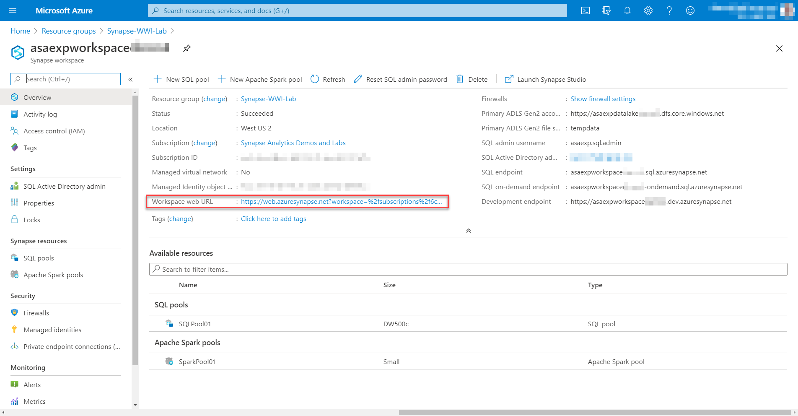 

Once you access your workspace select the arrow on the top of the left menu to open the slider and access various sections of the workspace.

## Exercise 1: Data Orchestration and Ingestion

### Task 1: Data Ingestion

1. On the Synapse Home page select **Ingest**.

2. In the Copy data dialog select **Next**.

3. Select **Create new connection**

4. See all available data providers.

### Task 2: Migrate SAP Hana to Azure Synapse Analytics

1. Select **Orchestrate**

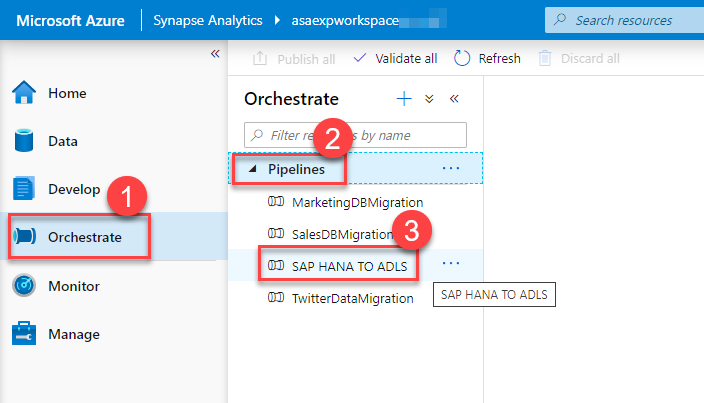

2. Select/Expand **Pipelines** and then select **SAP HANA TO ADLS** pipeline.

3. From the editor window select **Copy data** activity. Then select **Source** property of the **Copy data** activity to see the **Source Dataset** and observe that the query is pulling data from SAP Hana

4. With copy data selected, select the **Sink** property of the **Copy data** activity. Look at the **Sink** dataset, in this case; you are saving to ADLS Gen2 storage container.

5. Select **Mapping Data Flow** activity and then select **Settings**. Next select **Open** to go to **Data Flow** editor.

6. In Data Flow editor observe the flow. Look in detail into each activity using the following steps.

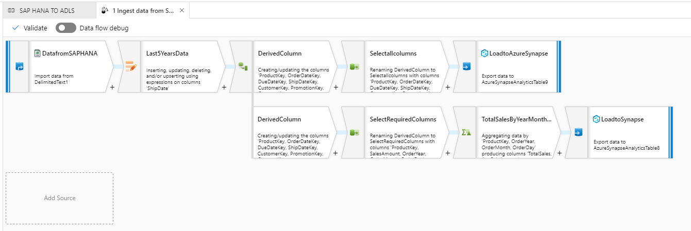

7.	In the **first activity**, we are selecting data from the Data Lake staging area.
8.	In the **second activity**, we are filtering data for the last 5 years.

9.	In the **third activity**, we are deriving columns from a **Column Order Date**.

10.	In the **fourth activity**, we are only selecting the required columns from the table.

11. In the **fifth activity**, we are creating an aggregated **Total Sales** grouped by **Year** and **Month**.

12. In the **sixth activity**, we load the aggregated table to Azure Synapse.

20. In the **seventh activity**, we are taking a parallel route by selecting all the remaining rows and writing the full table to Azure Synapse.

21. To view all the available transformations in the data flow editor, select the **+ (add action)**, which is to the right of the first activity.

22.	Scroll down to see the full list of transformations at different levels.

### Task 3: Code First Experience: Migrate Teradata to Azure Synapse Analytics

1. In the Orchestrate hub, select **MarketingDBMigration** from the list of pipelines.

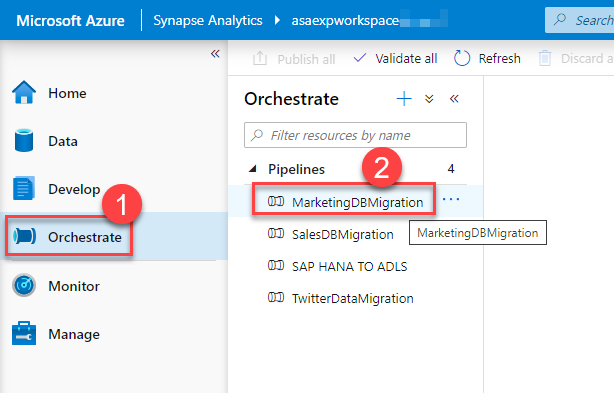

**Note:** This pipeline is for demonstration purposes only. __Do NOT execute__ the pipeline.

2. Select **Lookup** activity, then select **Settings** to observe the **Source dataset** property (Teradata).

3. Select **Copy data** activity and observe **Source** and **Sink** properties.

4. Select **Prep data in Azure Synapse** Notebook, then select **Settings**. Once you are in the settings tab, select **Open** to open the notebook

5.	Show the Python code. This is the code first experience in Synapse analytics.

### Task 4: Migrate last five years of sales transactional data from Oracle to Azure Synapse Analytics

1. Select **SalesDBMigration** from the **Orchestrate** hub.

2. Select **Lookup** activity and then **Settings** to see **OracleSalesDB** field in **Source Dataset** field

3. Select **Copy data** and see Synapse as the **sink**.

### Task 5: Moving semi-structured data to Azure Synapse Analytics

1. Select **TwitterDataMigration** from the list of pipelines.

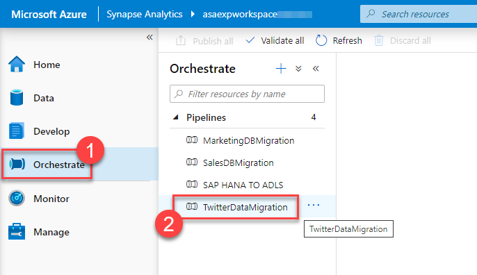

2. Look at the **Copy data**, **Archive Tweets data in ADLS Gen2** and **Clean up the archived Twitter Data** activities. 

### Task 6: On Demand Query: Azure Data Lake Gen2

1. Select **Data** Hub from the left navigation in the Synapse Analytics workspace. From the **Data** blade, under **Storage accounts**, Select/expand **daidemosynapsestorageforgen2**. Observe various data sources (including CI) that are now in ADL Gen2 and then select **twitterdata** storage container.

2. See all the parquet files and other folders in the **twitterdata** container. Select the first two parquet files and right click, from the context menu, Select **New SQL Script**

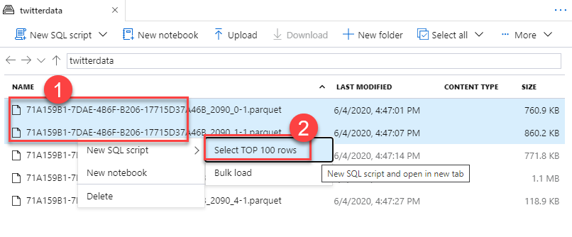

3. Select **Run**.

**TODO 2** Currently not working.

4. Select **Chart**

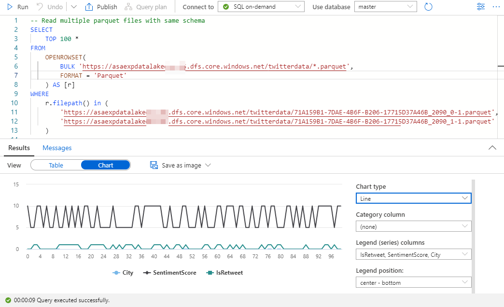

5. Minimize the **storage accounts** on the left side, then expand the **Databases** tree, expand **AzureSynapseDW (SQL pool)**, and finally expand **Tables** folder.

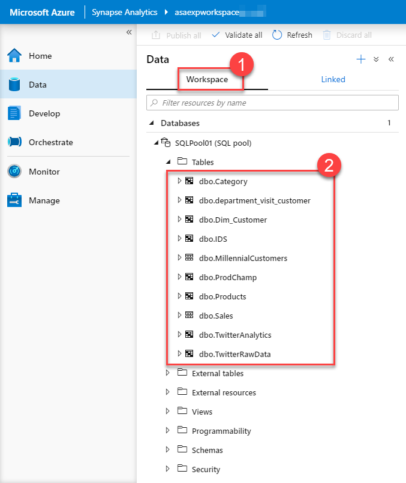

### Task 7: COPY INTO Command

1. Select **Develop**, then expand **SQL Scripts** to list all available scripts. Select **8 External Data to Synapse Via Copy Into** and highlight the query presented below titled **Step:1**.

2. Select **Run** and observe the **No results found** message.

3.	Scroll to the bottom and select **COPY INTO** query below **Step:2** as shown in the screenshot. Finally, select **Run**

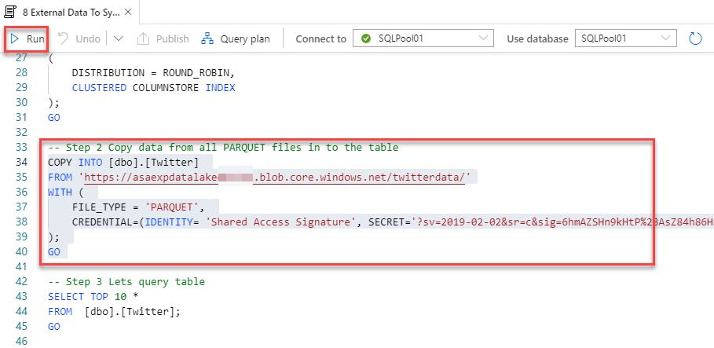

## Exercise 2: Develop Hub

### Task 1: Running Queries against 30 Billion records

1. Select **Develop** in the various tabs available in the **Develop** hub workspace and discover the environment. 

2. Select **SQL Scripts** and then select **1 SQL Query with Synapse**

3. Select **AzureSynapseDW** SQL Pool from the **Connect to** drop down menu. Once the **Use database** drop dows is populated select **AzureSynapseDW** database from the **Use Database** drop down. Finally, select the below query (#3 in the screenshot)

`SELECT COUNT_BIG(1) as TotalCount  FROM wwi.Sales(nolock)`

4. Select **Run** and observe the results (30 Billion).

5. Scroll down a few lines to the second query, select the query as shown in the screenshot, and then select **Run**. Observe time the query takes – query time is listed at the bottom of the screenshot.

5. Select the **chart** button, and then select **chart type** dropdown to see various chart types 

### Task 2: JSON Extractor Differentiator and other optional differentiator

1. Select **Develop**, and then select **2 JSON Extractor**. 

2. From the **Connect to** dropdown connect to **AzureSynapseDW** SQL Pool. Select the query as shown in the screenshot and select **Run**.

3. Observe the results of query 

### Task 3: Using Notebooks to Run Machine Learning Experiments

1. Select the **Develop** hub from the Synapse workspace. Next, select and expand the **Notebooks** option.

2. Select the **1. Product Recommendations** notebook, which will open the notebook.

3. Once the notebook is open, select **CDP DreamPool** from the **Attach to** dropdown. CDP DreamPool is a Spark Pool. Select **PySpark** from the **Language** dropdown list.

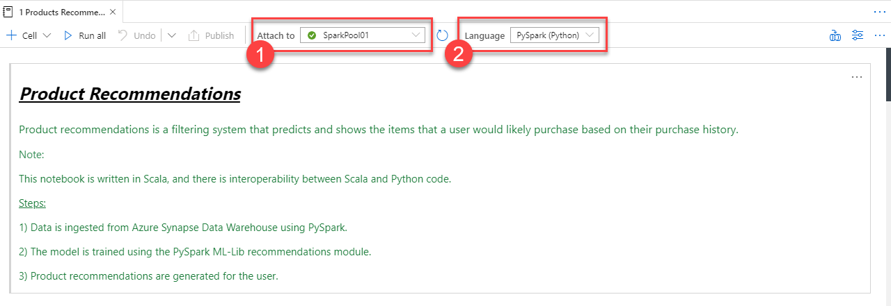

4. Expand **Language** and see supported languages.

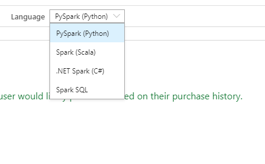

5. Observe the import statements in the Notebook 

**TODO 4** Not available in the environment

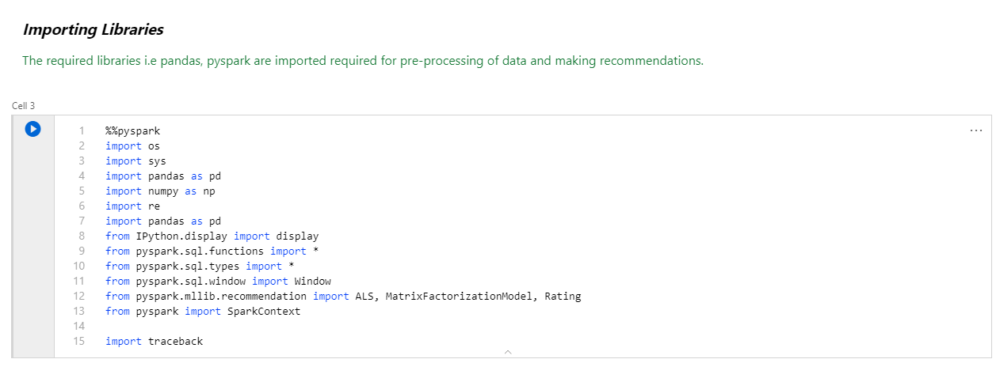

6. Observe the results in the notebook under **Map Products**.

See code in **cell 26**, but **DO NOT** execute any code.

### Task 4: AutoML in Azure Synapse Analytics 

1. Select **Develop** from the Synapse workspace

2. Expand **Notebooks** section and select **2 AutoML Customer Forecasting** Notebook.

3. Scroll down to see the content in the screenshot in Cell 22.

4. Scroll down to observe the content in the screenshot in Cell 26.

5. Scroll down to see the code in **cell 38**.

6. Scroll down to see **cell 41**.

## Exercise 3: Power BI reporting within the Synapse Analytics workspace 

### Task 1: Accessing PowerBI reports in Synapse Analytics workspace 

1. Select **Develop** from the Synapse workspace and expand the **Power BI** section. Next, expand **Data & AI Demo** (which is a Power BI workspace) and expand **Power BI** reports. Finally, select **1. CDP Vision Demo** Power BI report. This will open the decomposition tree.

2. Once the report is open, in the **Decomposition Tree Analysis** tab see **Store Visits by Campaign** then by **Region**. Select **+** next to **North & Central America** 

3. Select **QnA** tab 

4. In the **Q&A** box, type **profit by country by product category as treemap**

### Task 2: Ad Hoc Reporting in Azure Synapse Analytics

1. From the **Develop** hub, **Power BI** section select **2. Billion Rows Demo** Power BI report.

2. Select the empty area in the report canvas. Next, from the **Fields** list select or drag and drop **CustomerId** from **wwi AllSales** table to the report canvas.

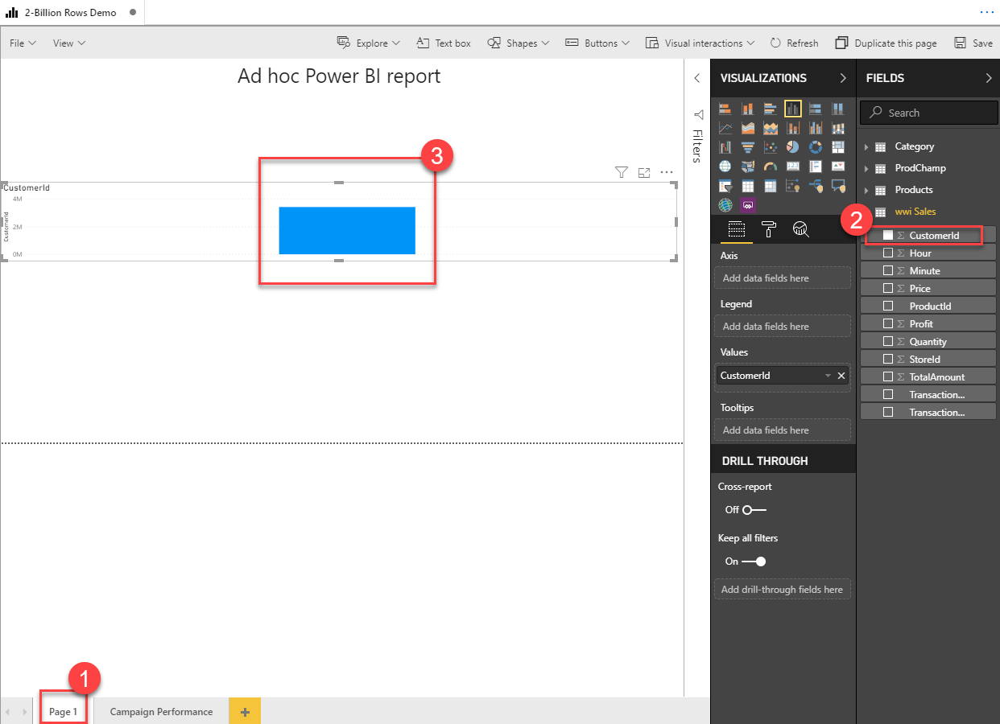

3. From the Visualizations pane select the **card visual**. Resize and move the **card visual** to see what is shown in screenshot.

4. Select the empty area in the report canvas. From the **Fields** list select or drag and Drop **CustomerId** from **wwi AllSales** table to the report canvas. [Pointer 1 from the screenshot]. Then select **Name** field from the **Products** table [Pointer 2 from the screenshot]. Then select **Campaign** field from the **ProdChamp** table [Pointer 3 from the screenshot]. From the **Visualizations** pane select the **Treemap** icon [Pointer 4 from the screenshot].

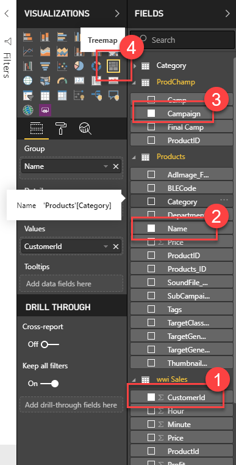

5.	Resize and move the **card visual** as shown in the screenshot.

6. Select an empty area in the report canvas.Then select the **Campaign** field from the **ProdChamp** table [Pointer 1 from the screenshot]. Then select **Profit** field from the **wwi AllSales** table [Pointer 2 from the screenshot]. Finally, from the **Visualizations** pane select the **Bar Chart** icon [Pointer 3 from the screenshot].

7. Resize and move the **card visual** as shown in the screenshot. 

8. Hover over **Save** button, but **do NOT** save.

## Exercise 4: Visualizing the data using the Power BI dashboard

As you evaluate tools to find the right amount of power, flexibility, this exercise will introduce you to a PowerBI Dashboard that brings data sources from various reports. You will have the chance to look into every report one by one directly in Power BI.

Duration: 20 minutes.

### Task 1: Access Data and AI Demo Dashboard

A Power BI dashboard is a single page, often called a canvas, that uses visualizations to tell a story. Because it is limited to one page, a well-designed dashboard contains only the most-important elements of that story. 

The visualizations you will see on the dashboard are called tiles and are pinned to the dashboard by report designers. In most cases, selecting a tile takes you to the report page where the visualization was created. During the next tasks we will look at various reports that are linked to our dashboard called `Data and AI Demo Dashboard`.

1. Sign in to the [Power BI Portal](https://powerbi.microsoft.com/) using your Azure credentials.

2. From the hamburger menu select **Workspaces** to access the list of workspaces available to you. Select the workspace named `ASA-EXP`.

3. Select `Data & AI Demo Dashboard` to launch the dashboard.

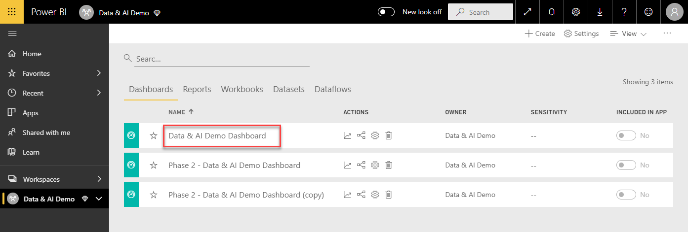

### Task 2: Campaign Analytics Report

A Power BI report is a multi-perspective view into a dataset, with visuals that represent different findings and insights from that dataset. The visuals aren't static. They update as the underlying data changes. You can interact with the visuals and filters as you dig into the data to discover insights and look for answers. Like a dashboard, a report is highly interactive and highly customizable.

During the next couple of tasks we will look at various reports that are linked to our original dashboard called `Data and AI Demo Dashboard`.

1. Select **Campaign revenue vs target** to access `The Campaign Analytics` report.

2. Select **Enjoy the Moment** campaign from the top filter.

3. In the `Sentiment by product category`, Select Positive sentiment for the **Cocktail Glasses** product category.

4. Then Select Negative sentiment for the **Exercise** product category.

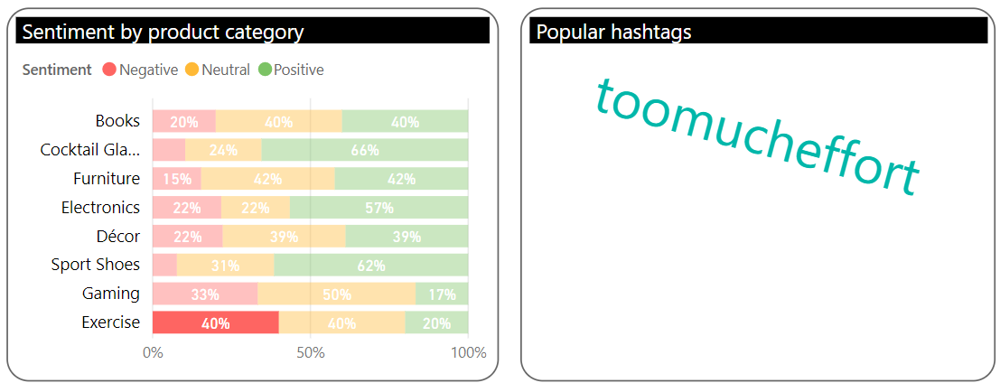

### Task 3: Realtime Twitter Analytics

1. Select **No. of tweets** from **Realtime Twitter analytics** pillar to access `Realtime Twitter ayanlysis` report.

2. Select **Shopping** from **Tweets by Sentiment Category** and observe the changes on the map visual. 

### Task 4: Retail Heat Map

1. [Click here to watch](media/New-Store-Simulation.avi) the heat map video. 

### Task 5: Location Analytics 

1. Select **Total visitors** from **Realtime location analytics** pillar to access `Location Analytics` report.

2. See **Visit to by store department**, then select long `visit_type` in the Entertainment department.

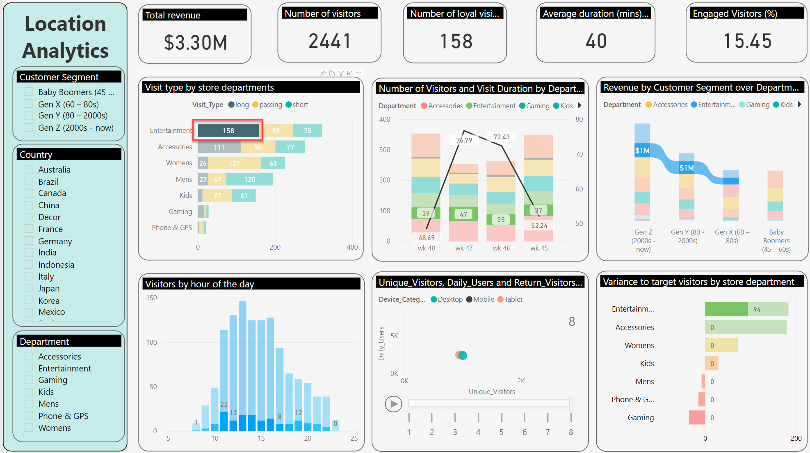

3. Select short `visit_type` in the Mens department.

4. Select **Gen Y** in `Revenue by customer segment over department visual` and Hover over **Visitors by the hour of day** visual. 

5. Select **play** on a Scatter plot to see what devices are used by visitors.

### Task 6: Product Recommendation

1. Select **Recommended Products** from **Product recommendation analytics** pillar to access `Product Recommendations` report.

2. Select **Cocktail Glasses** in **Product Category** filter.

3. Select **Running Shoes** in **Product Category** filter.

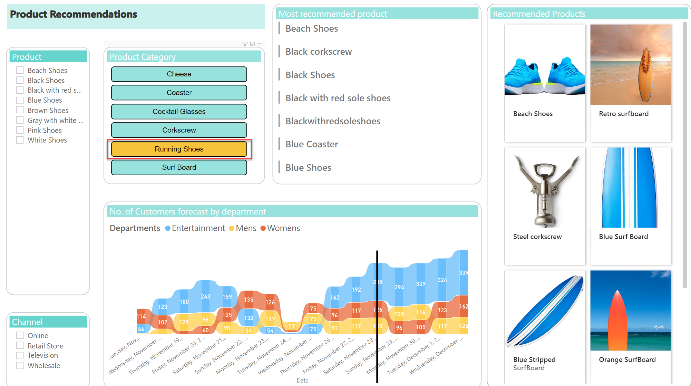
