**Contents**

<!-- TOC -->

- [Azure Synapse hands-on lab step-by-step](#)
  - [Accessing Synapse Workspace](#Accessing-Synapse-Workspace)
  - [Exercise 1: Data Orchestration and Ingestion](#Exercise-1-Data-Orchestration-and-Ingestion)
    - [Task 1: Data Ingestion](#Task-1-Data-Ingestion)
    - [Task 2: Migrate SAP Hana to Azure Synapse Analytics](#Task-2-Migrate-SAP-Hana-to-Azure-Synapse-Analytics)
    - [Task 3: Code First Experience: Migrate Teradata to Azure Synapse Analytics](#Task-3-Code-First-Experience-Migrate-Teradata-to-Azure-Synapse-Analytics)
    - [Task 4: Migrate last five years of sales transactional data from Oracle to Azure Synapse Analytics](#Task-4-Migrate-last-five-years-of-sales-transactional-data-from-Oracle-to-Azure-Synapse-Analytics)
    - [Task 5: Moving semi-structured data to Azure Synapse Analytics](#Task-5-Moving-semi-structured-data-to-Azure-Synapse-Analytics)
    - [Task 6: On Demand Query: Azure Data Lake Gen2](#Task-6-On-Demand-Query-Azure-Data-Lake-Gen2)
    - [Task 7: COPY INTO Command](#Task-7-COPY-INTO-Command)
  - [Exercise 2: Develop Hub](#Exercise-2-Develop-Hub)
    - [Task 1: Running Queries against 30 Billion records](#Task-1-Running-Queries-against-30-Billion-records)
    - [Task 2: JSON Extractor Differentiator and other optional differentiator](#Task-2-JSON-Extractor-Differentiator-and-other-optional-differentiator)
    - [Task 3: Using Notebooks to Run Machine Learning Experiments](#Task-3-Using-Notebooks-to-Run-Machine-Learning-Experiments)
    - [Task 4: AutoML in Azure Synapse Analytics](#Task-4-AutoML-in-Azure-Synapse-Analytics)
  - [Exercise 3: Power BI reporting within the Synapse Analytics workspace](#Exercise-3-Power-BI-reporting-within-the-Synapse-Analytics-workspace)
    - [Task 1: Accessing PowerBI reports in Synapse Analytics workspace](#Task-1-Accessing-PowerBI-reports-in-Synapse-Analytics-workspace)
    - [Task 2: Ad Hoc Reporting in Azure Synapse Analytics](#Task-2-Ad-Hoc-Reporting-in-Azure-Synapse-Analytics)
  - [Exercise 4: Visualizing the data using the Power BI dashboard](#exercise-4-visualizing-the-data-using-the-power-bi-dashboard)
    - [Task 1: Access Data and AI Demo Dashboard](#Task-1-Access-Data-and-AI-Demo-Dashboard)
    - [Task 2: Campaign Analytics Report](#Task-2-Campaign-Analytics-Report)
    - [Task 3: Realtime Twitter Analytics](#Task-3-Realtime-Twitter-Analytics)
    - [Task 4: Retail Heat Map](#Task-4-Retail-Heat-Map)
    - [Task 5: Location Analytics ](#Task-5-Location-Analytics )
    - [Task 6: Product Recommendation](#Task-6-Product-Recommendation)
    
<!-- /TOC -->

# Accessing Synapse Workspace

Select the Synapse Workspace web URL to access your Synapse Workspace.

 

Once you access your workspace select the arrow on the top of the left menu to open the slider and access various sections of the workspace.

> Welcome to Azure Synapse Analytics
> 
> Azure Synapse is an end to end analytics platform which combines SQL data warehousing, big data analytics and data integration into a single integrated environment. 
> 
> Synapse empowers users to gain quick access and insights across all of their data, enabling a whole new level of performance and scale that is simply unmatched in the industry.
> 
> As you will see here in our workspace, Synapse brings all of our data into a single service. Synapse does not just remove the silos between people in the organization, it also brings the data closer together.
>
> ***Supplementary Info:** Azure Synapse Analytics is the evolution of the Azure SQL data warehouse service. With Azure Synapse, we give you a unified service with fully integrated capabilities, not just ETL. We've also enabled hybrid data ingestion and orchestration and secure Self Service Enterprise Analytics. Through our data warehouse we're also providing AI and big data processing built into Synapse. We've added capabilities such as efficient compute for on-demand query processing as well as monitoring, management, and integrated security.* 

## Exercise 1: Data Orchestration and Ingestion

### Task 1: Data Ingestion

1. On the Synapse Home page select **Ingest**.

> Now that we’re in the workspace, let’s begin with ingestion.
> 
> In the Synapse world, data connections are called ‘Linked Services’.  

2. In the Copy data dialog select **Next**.

3. Select **Create new connection**

> In the Source data store section, we can see existing data connections (linked services) or we can add new connections.
> 
> Let’s create a new connection.

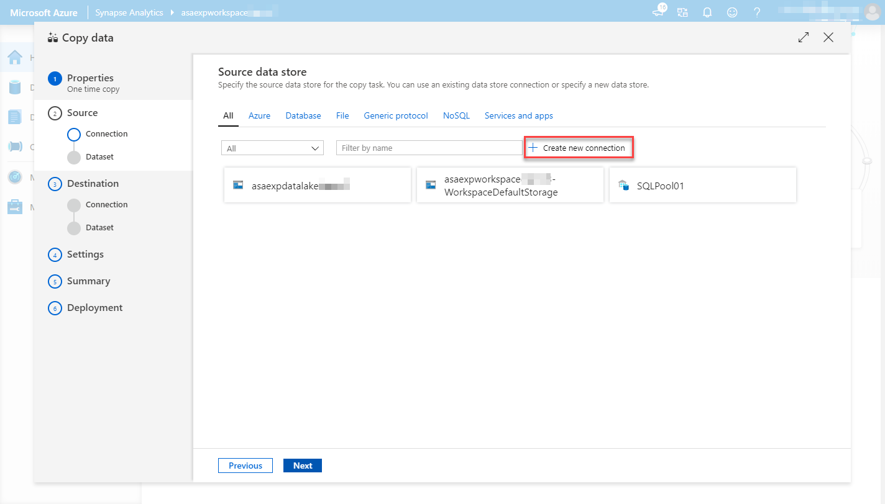

4. See all available data providers.

> Synapse has linked services to **over 90** different data providers or data sources. **These can include hybrid on-prem data, other clouds and SaaS applications.** You can bring data from AWS, or Google, or from Teradata, Netezza, Oracle, or SAP Hana. 

### Task 2: Migrate SAP Hana to Azure Synapse Analytics

1. Select **Orchestrate**

> Now let’s talk about pipelines related to our demo. 
> 
> Let’s go to the orchestrate hub, which is where data engineers can build pipeline, orchestrate data movement, and deploy pipelines into production. 
> 
> Let’s look at the pipelines that we previously set up.  
> 
> Wide World Importers has data stored in Teradata, Netezza, and Oracle appliances.  They also have data in SAP Hana, and they would like to ingest semi-structured Twitter data. 
> 
> Synapse has two types of pipeline experiences – code free and code first.

2. Select/Expand **Pipelines** and then select **SAP HANA TO ADLS** pipeline.

> Let’s take a look at the **code free** experience. Here we’re ingesting finance data from SAP Hana without writing any code.
> 
> In this pipeline we connect to an SAP Hana data source and move the data to an ADLS Gen2 storage container. 

3. From the editor window select **Copy data** activity. Then select **Source** property of the **Copy data** activity to see the **Source Dataset** and observe that the query is pulling data from SAP Hana

> As you can see, here is the data coming from SAP Hana.

4. With copy data selected, select the **Sink** property of the **Copy data** activity. Look at the **Sink** dataset, in this case; you are saving to ADLS Gen2 storage container.

> And this data moves to Azure Data Lake Gen2. 

5. Select **Mapping Data Flow** activity and then select **Settings**. Next select **Open** to go to **Data Flow** editor.

> Now let’s click on “Mapping Data Flow”, which will show us what activities are happening in this particular data flow.

6. In Data Flow editor observe the flow. Look in detail into each activity using the following steps.

> As you can see in this data flow, we’re moving data from SAP to the Data Lake, and we’re doing transformations along the way, and then load it to Synapse.
> 
> Synapse makes building these complex end to end pipelines a simple, intuitive, visual, no code experience. 
> 
> ***Supplementary Info:** The Data Flows activity in the Orchestrate hub provides a way to transform data at scale without any coding required. You can design a data transformation job in the data flow designer by constructing a series of transformations. Start with any number of source transformations followed by data transformation steps. Then, complete your data flow with sink to land your results in a destination.*

7.	In the **first activity**, we are selecting data from the Data Lake staging area.
8.	In the **second activity**, we are filtering data for the last 5 years.

9.	In the **third activity**, we are deriving columns from a **Column Order Date**.

10.	In the **fourth activity**, we are only selecting the required columns from the table.

11. In the **fifth activity**, we are creating an aggregated **Total Sales** grouped by **Year** and **Month**.

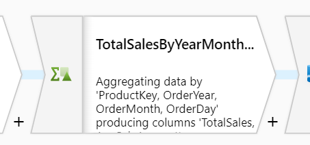

12. In the **sixth activity**, we load the aggregated table to Azure Synapse.

20. In the **seventh activity**, we are taking a parallel route by selecting all the remaining rows and writing the full table to Azure Synapse.

21. To view all the available transformations in the data flow editor, select the **+ (add action)**, which is to the right of the first activity.

> In the data flow there is a variety of simple no-code transformation options available.
> 
> Let’s take a look at these.

22.	Scroll down to see the full list of transformations at different levels.

### Task 3: Code First Experience: Migrate Teradata to Azure Synapse Analytics

1. In the Orchestrate hub, select **MarketingDBMigration** from the list of pipelines.

> Now let’s go over to a pipeline where we have created a **code first** experience to bring marketing data from Teradata.

**Note:** This pipeline is for demonstration purposes only. __Do NOT execute__ the pipeline.

2. Select **Lookup** activity, then select **Settings** to observe the **Source dataset** property (Teradata).

> As you can see, we are simulating this marketing campaigns data to be coming from Teradata.

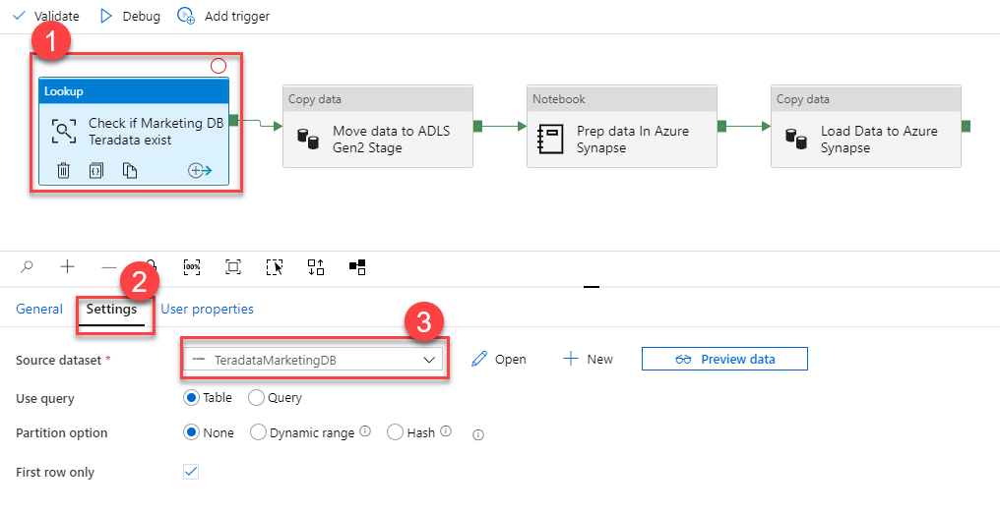

3. Select **Copy data** activity and observe **Source** and **Sink** properties.

> You can see that we are moving this data to ADLS Gen2.

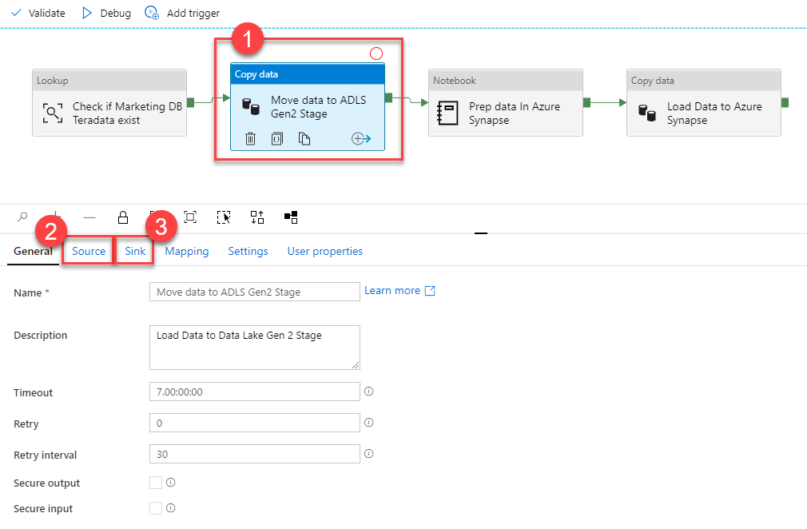

4. Select **Prep data in Azure Synapse** Notebook, then select **Settings**. Once you are in the settings tab, select **Open** to open the notebook

> If you click on “Prep Data” and then “open”…

5.	Show the Python code. This is the code first experience in Synapse analytics.

> …you’ll see that we have Python code here. We are pulling data from the Marketing DB staging area. Then we are doing a transformation and introducing the derived column `Revenue_Variance`.

### Task 4: Migrate last five years of sales transactional data from Oracle to Azure Synapse Analytics

1. Select **SalesDBMigration** from the **Orchestrate** hub.

> Let’s look at another pipeline. In this pipeline we are simulating data coming from Oracle. 
> 
> Wide World Importers has 5+ years of sales data from Oracle, 30+ billion rows.

2. Select **Lookup** activity and then **Settings** to see **OracleSalesDB** field in **Source Dataset** field

3. Select **Copy data** and see Synapse as the **sink**.

> To recap, so far we have looked at pipelines for:  
> •	Finance data coming in from SAP Hana,  
> •	Marketing data coming in from Teradata,  
> •	Sales data coming in from Oracle 

### Task 5: Moving semi-structured data to Azure Synapse Analytics

1. Select **TwitterDataMigration** from the list of pipelines.

> Wide World Importers also has data coming  from Twitter.

2. Look at the **Copy data**, **Archive Tweets data in ADLS Gen2** and **Clean up the archived Twitter Data** activities. 

> Here is the pipeline that brings semi-structured data – in this case Twitter data - into Azure Synapse.

### Task 6: On Demand Query: Azure Data Lake Gen2

1. Select **Data** Hub from the left navigation in the Synapse Analytics workspace. From the **Data** blade, under **Storage accounts**, Select/expand **daidemosynapsestorageforgen2**. Observe various data sources (including CI) that are now in ADL Gen2 and then select **twitterdata** storage container.

> Now that we have all this data in one place, let’s go to Azure Data Lake Gen2, all part of the Synapse workspace.
> 
> We have everything in one place. We have sales data, marketing data, finance data, and we also have the data from Customer Insights. Remember Gen Y millennial high value customers? All those segments are here too.
> 
> Now that we have all this data in one place, we can actually start querying some of this data right here, right now!
> 
> Let’s look at this Twitter data. These are parquet files.

2. See all the parquet files and other folders in the **twitterdata** container. Select the first two parquet files and right click, from the context menu, Select **New SQL Script**

> Let’s run the query. It’s very easy.  No need to pre-provision any pools. 
> 
> I simply select some of these files. 
> 
> I right click and select “new SQL script” and Synapse will detect the type of data that we’re analyzing and automatically generate a SQL statement. 

3. Select **Run**.

> If I click on run, we can use “Query as a Service/SQL on demand”. This is an on-demand query service that allows you to work directly over the data lake and analyze the data. 
> 
> It will actually provision the needed compute resources at the exact moment that you need them. No need to pay for pre-provisioned resources as we’re not going to need them all the time.
> 
> As a result of using on-demand query, data storage costs are reduced significantly.
> 
> It's amazing, because we’re actually querying over a data lake and I can do all of that right from the Synapse workspace. 

4. Select **Chart**

> We can easily visualize our results.

5. Minimize the **storage accounts** on the left side, then expand the **Databases** tree, expand **AzureSynapseDW (SQL pool)**, and finally expand **Tables** folder.

> I can also load selected data directly into Synapse tables as pre-provisioned pools, part of the high performance MPP data warehousing platform, and that becomes the **enterprise source of truth**.  
> 
> I can meet the performance expectations for the enterprise data warehouse by pre-provisioning those resources when I have demanding workloads. 
> 
> And, I can switch between query modes based on my workload. The best of both worlds!
> 
> Let’s take a look at the Synapse tables that I have available in my pre-provisioned SQL pool, with sales, campaigns, finance, and more.
> 
> ***Supplementary Info:** Synapse extends the capabilities of SQL data warehouse, so we're building on the performance, the elasticity, the security, the robustness in the scale of the service to give your analysts a single source of truth for the enterprise, all while enabling them to reduce storage costs.*

### Task 7: COPY INTO Command

1. Select **Develop**, then expand **SQL Scripts** to list all available scripts. Select **8 External Data to Synapse Via Copy Into** and highlight the query presented below titled **Step:1**.

> Let’s go to the Develop Hub.
> 
> If you remember we queried multiple parquet files from Twitter so let’s move this data into an Azure Synapse table.

2. Select **Run** and observe the **No results found** message.

> Let’s go to Azure Synapse to check if a Twitter table exists already. And if it doesn’t exist, let’s create an empty Twitter table.

3.	Scroll to the bottom and select **COPY INTO** query below **Step:2** as shown in the screenshot. Finally, select **Run**

> Now we use a very simple “Copy Into” command to copy data from all the parquet files in the Azure Data Lake to a Synapse table. 
> That’s it! 
> 
> The hard part is over - now let’s start querying into this data

## Exercise 2: Develop Hub

### Task 1: Running Queries against 30 Billion records

> In the Develop hub:  
> •	If I’m a data analyst, I can write SQL data queries.    
> •	If I'm a data scientist I can create my notebooks, and I can create Spark jobs to do large-scale data processing within the same environment  
> •	And I have Power BI available right here so I can create ad hoc Power BI reports to publish and share with my business users.  Amazing isn’t it?

1. Select **Develop** in the various tabs available in the **Develop** hub workspace and discover the environment. 

> In this part of the demo, I am going to:
> 1.	open SQL scripts  
> 2.	run queries to fetch data from an Azure Synapse SQL pool
> 3.	view structured data tables
> 4.	visualize the data

2. Select **SQL Scripts** and then select **1 SQL Query with Synapse**

3. Select **AzureSynapseDW** SQL Pool from the **Connect to** drop down menu. Once the **Use database** drop dows is populated select **AzureSynapseDW** database from the **Use Database** drop down. Finally, select the below query (#3 in the screenshot)

> Let’s open a SQL script and run a query to find out how many rows of data we have in the sales table.  
> **Answer:** 30+ Billion Rows!

`SELECT COUNT_BIG(1) as TotalCount  FROM wwi.Sales(nolock)`

4. Select **Run** and observe the results (3443487).

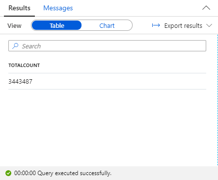

5. Scroll down a few lines to the second query, select the query as shown in the screenshot, and then select **Run**. Observe time the query takes – query time is listed at the bottom of the screenshot.

> Now I am going to run an amazing query over these 30 billion rows of data.  This dataset contains data from the sales table, Twitter sentiment data, our customer data from Customer Insights, and product information.
> 
> How long do you think it’s going to take?
> 
> The first time we executed this query, it took 7 seconds.  Right now, as you can see it took 2 seconds. It’s fast.

6. Select the **chart** button, and then select **chart type** dropdown to see various chart types 

> I can even visualize query results very simply by selecting “Chart”. There are various types of charts available. I can change this to be an area chart.

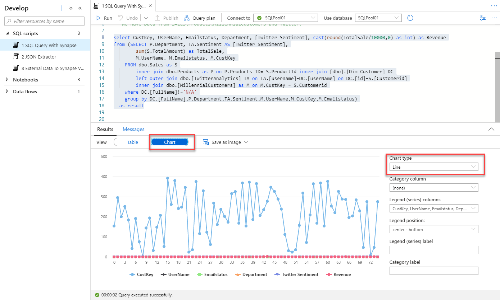

### Task 2: JSON Extractor Differentiator and other optional differentiator

1. Select **Develop**, and then select **2 JSON Extractor**. 

> JSON is a popular format used for data exchange between various modern applications and services. It is also used for storing semi-structured data e.g. historical IoT data, or social media data like Tweets.

2. From the **Connect to** dropdown connect to **AzureSynapseDW** SQL Pool. Select the query as shown in the screenshot and select **Run**.

> Azure Synapse enables you to store JSON in standard textual format and use standard SQL language for querying JSON data. 
>  
> Let’s see the JSON Extractor in action. We’re going to extract specific columns from our Twitter data.

3. Observe the results of query 

### Task 3: Using Notebooks to Run Machine Learning Experiments

> In the Develop Hub, data scientists can create their machine learning experiments using Python or Scala notebooks.

1. Select the **Develop** hub from the Synapse workspace. Next, select and expand the **Notebooks** option. Select the **1. Product Recommendations** notebook, which will open the notebook.

> Let’s look at how Synapse, using the Apache Spark framework, brings together big data and machine learning.  
>
> ***Supplementary Info:** During this demo we will mainly use PySpark. PySpark is a programming language used in the Spark framework that is mainly used for processing structured and semi-structured datasets. It provides an optimized API that can read data from disparate data sources, at scale.* 
>
> Let’s look at a notebook where we use machine learning to create product recommendations.

2. Once the notebook is open, select **CDP DreamPool** from the **Attach to** dropdown. CDP DreamPool is a Spark Pool. Select **PySpark** from the **Language** dropdown list.

> You can see that we are attached to a Spark pool, and we are using the PySpark language.

3. Expand **Language** and see supported languages.

> Notebooks in Synapse support several languages including:
> 
> PySpark  
> Spark  
> .NET  
> Spark SQL

4. Observe the import statements in the Notebook 

> Most Python packages come pre-installed in Synapse. Libraries can also be imported, and custom packages can also be installed.
> 
> We can read from our databases and write to the tables in the database so that the data can be used in other applications like Power BI or other websites.
> 
> Let’s scroll through this notebook and show the output.

5. Observe the results in the notebook under **Map Products**.

> Once the trained model is loaded, we use it to recommend 5 products for every customer and use this to recommend other products as well.

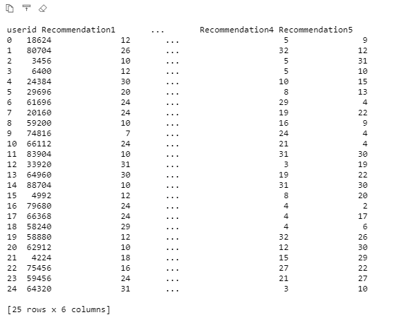

See code in **cell 27**, but **DO NOT** execute any code.

> We then store the results back to the database table, for further consumption by other applications and users.

### Task 4: AutoML in Azure Synapse Analytics 

1. Select **Develop** from the Synapse workspace

> In the Develop Hub of Synapse we can re-use or connect to an existing AutoML workspace.
>
> ***Supplementary Info:** With Automated Machine Learning we can automate time-intensive tasks. AutoML learns rapidly by iterating over many combinations of algorithms and hyperparameters to help you find the best model based on a success metric of your choosing.*

2. Expand **Notebooks** section and select **2 AutoML Customer Forecasting** Notebook.

> Let’s select the AutoML Customer Forecasting notebook which was previously created.

3. Scroll down to see the content in the screenshot in Cell 22.

> Let’s scroll through this notebook and see the AutoML configuration and the experiment’s output.
> 
> This is the configuration for submitting an automated machine learning experiment in Azure ML. 

4. Scroll down to observe the content in the screenshot in Cell 26.

> Here we are looking at the output of the experiment. 
> 
> The AutoML pipeline runs more than 25 models and grades them according to performance. 

5. Scroll down to see the code in **cell 38**.

> The model with the best performance is then used for predicting the number of customers. We can also use this model to recommend number of customers per department.

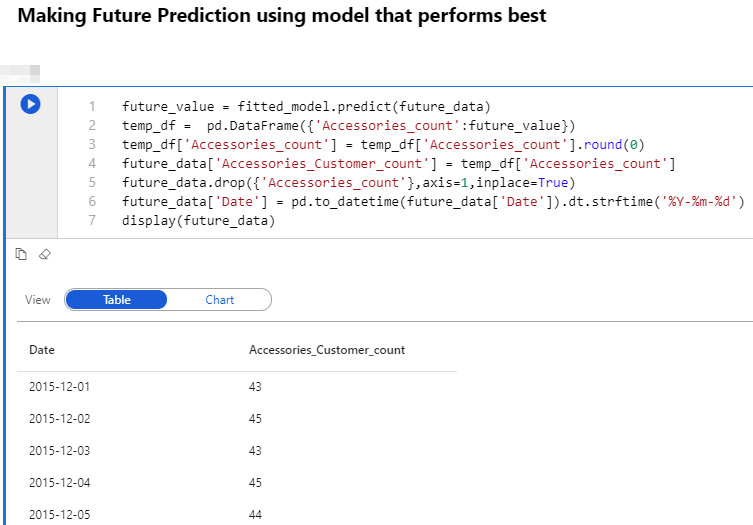

6. Scroll down to see **cell 41**.

> The model can then be registered for deployment as REST Endpoint by specifying the description and assigning tags.

## Exercise 3: Power BI reporting within the Synapse Analytics workspace 

### Task 1: Accessing PowerBI reports in Synapse Analytics workspace 

1. Select **Develop** from the Synapse workspace and expand the **Power BI** section. Next, expand **Data & AI Demo** (which is a Power BI workspace) and expand **Power BI** reports. Finally, select **1. CDP Vision Demo** Power BI report. This will open the decomposition tree.

> Let’s switch gears and move to Power BI. 
> 
> From within the Synapse workspace, data analysts can actually use Power BI and create reports.
> 
> Let’s take a look at that.

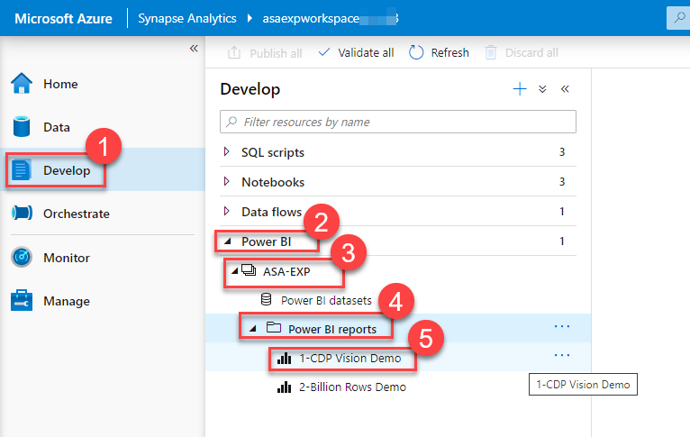

2. Once the report is open, in the **Decomposition Tree Analysis** tab see **Store Visits by Campaign** then by **Region**. Select **+** next to **North & Central America** 

> This decomposition tree shows the clicks on the Wide World Importers website. 
> 
> The root node of this tree shows the number of visits to the website during a certain period. We can drill down to see website visits by campaign and then by global region.

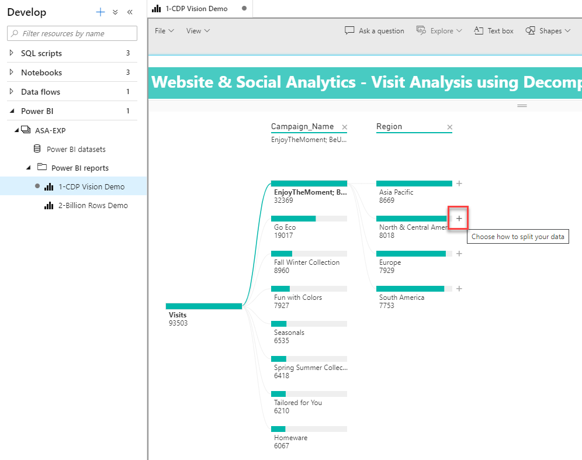

3. Select **QnA** tab 

> Now let’s switch to the QnA tab.

4. In the **Q&A** box, type **profit by country by product category as treemap**

> This is a great feature where we can enter English language questions to create visualizations.  Let’s look at the profit by country, shown as a tree map.  
> Amazing, isn’t it? 
>
> ***Supplementary Info:** As you type your question, Q&A picks the best visualization to display your answer; and the visualization changes dynamically as you modify the question. Also, Q&A helps you format your question with suggestions, autocomplete, and spelling corrections. Q&A recommends also small wording changes.*

### Task 2: Ad Hoc Reporting in Azure Synapse Analytics

1. From the **Develop** hub, **Power BI** section select **2. Billion Rows Demo** Power BI report.

> Let’s create a few ad hoc Power BI reports from right here within Synapse.
> 
> These reports can be saved and shared with other users from within the Synapse workspace and shared at enterprise level.

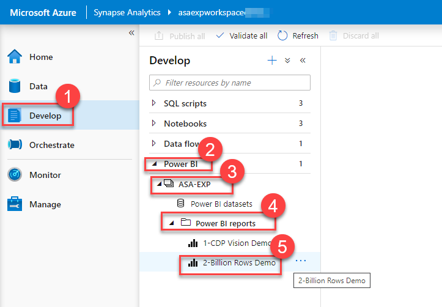

2. Select the empty area in the report canvas. Next, from the **Fields** list select or drag and drop **CustomerId** from **wwi AllSales** table to the report canvas.

> Let’s see how many rows of data we have here in this data set.

3. From the Visualizations pane select the **card visual**. Resize and move the **card visual** to see what is shown in screenshot.

> You can see that we have just over 30 billion rows of data.

4. Select the empty area in the report canvas. From the **Fields** list select or drag and Drop **CustomerId** from **wwi AllSales** table to the report canvas. [Pointer 1 from the screenshot]. Then select **Name** field from the **Products** table [Pointer 2 from the screenshot]. Then select **Campaign** field from the **ProdChamp** table [Pointer 3 from the screenshot]. From the **Visualizations** pane select the **Treemap** icon [Pointer 4 from the screenshot].

> With these 26 billion rows, I am going to create another quick visualization here in front of you.
> 
> Let’s see which products are performing well for our various campaigns. 

5.	Resize and move the **card visual** as shown in the screenshot.

6. Select an empty area in the report canvas.Then select the **Campaign** field from the **ProdChamp** table [Pointer 1 from the screenshot]. Then select **Profit** field from the **wwi AllSales** table [Pointer 2 from the screenshot]. Finally, from the **Visualizations** pane select the **Bar Chart** icon [Pointer 3 from the screenshot].

> Let’s create another visualization to show profit by campaign.

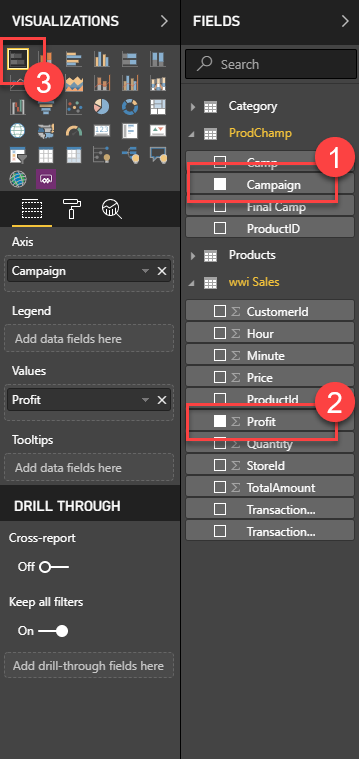

7. Resize and move the **card visual** as shown in the screenshot. 

> Now it’s very simple, we just click on the campaign that we’re interested in, and we can see this fast interactivity between the two visuals. We can optionally save and share this report with business users.
> 
> This just shows the power of Synapse.  You get billions of rows of data coming in from all kinds of sources, and you get interactivity and amazing insights very quickly that can be shared at enterprise level.

8. Hover over **Save** button, but **do NOT** save.

> Now that we have all these different kinds of data coming into Synapse – structured, unstructured, real-time data - coming in from all those different sources – Customer Insights, SAP Hana, Oracle, Teradata, Twitter – let’s take a look again at our Power BI dashboard. 

## Exercise 4: Visualizing the data using the Power BI dashboard

As you evaluate tools to find the right amount of power, flexibility, this exercise will introduce you to a PowerBI Dashboard that brings data sources from various reports. You will have the chance to look into every report one by one directly in Power BI.

Duration: 20 minutes.

### Task 1: Access Data and AI Demo Dashboard

A Power BI dashboard is a single page, often called a canvas, that uses visualizations to tell a story. Because it is limited to one page, a well-designed dashboard contains only the most-important elements of that story. 

The visualizations you will see on the dashboard are called tiles and are pinned to the dashboard by report designers. In most cases, selecting a tile takes you to the report page where the visualization was created. During the next tasks we will look at various reports that are linked to our dashboard called `Data and AI Demo Dashboard`.

1. Sign in to the [Power BI Portal](https://powerbi.microsoft.com/) using your Azure credentials.

2. From the hamburger menu select **Workspaces** to access the list of workspaces available to you. Select the workspace named `ASA-EXP`.

3. Select `Data & AI Demo Dashboard` to launch the dashboard.

### Task 2: Campaign Analytics Report

A Power BI report is a multi-perspective view into a dataset, with visuals that represent different findings and insights from that dataset. The visuals aren't static. They update as the underlying data changes. You can interact with the visuals and filters as you dig into the data to discover insights and look for answers. Like a dashboard, a report is highly interactive and highly customizable.

During the next couple of tasks we will look at various reports that are linked to our original dashboard called `Data and AI Demo Dashboard`.

1. Select **Campaign revenue vs target** to access `The Campaign Analytics` report.

> Let’s go back to our scenario for Wide World Importers.  
> Remember our story about sales to millennials – sales were decreasing for this segment. 
> 
> With all these insights from Synapse, in September Wide World Importers launched seven campaigns based on their learnings about millennials.

2. Select **Enjoy the Moment** campaign from the top filter.

> Let’s see the performance of these campaigns.
>
> Here we can see the performance of the seven campaigns that Wide World Importers launched in September. Let’s see what’s happening with the “Enjoy the Moment” campaign. 

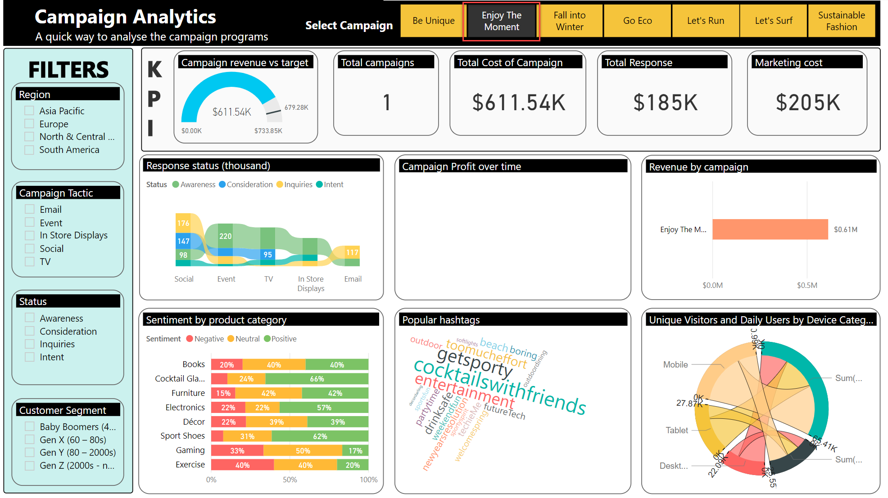

3. In the `Sentiment by product category`, Select Positive sentiment for the **Cocktail Glasses** product category.

> What we notice is that when people are having fun with cocktail glasses, they are happy, party time, drink safe.

4. Then Select Negative sentiment for the **Exercise** product category.

> When we ask them to work out the next day – too much effort.
> 
> We just looked at performance of campaigns since the September launch.

### Task 3: Realtime Twitter Analytics

1. Select **No. of tweets** from **Realtime Twitter analytics** pillar to access `Realtime Twitter ayanlysis` report.

> That was analytics based on past data, but even more exciting is real time analytics based on the present moment.
> 
> Three months have passed since we launched those campaigns.
> 
> Imagine the scenario – It’s the day after Thanksgiving in the USA, and it’s the Black Friday sale. The time is 6AM EST. Wide World Importers has 100 stores on the East Coast that just opened up. 
> 
> We are still running some of those campaigns and we have real-time Tweets and sentiments for those Tweets coming from all over the world, here in this dashboard.

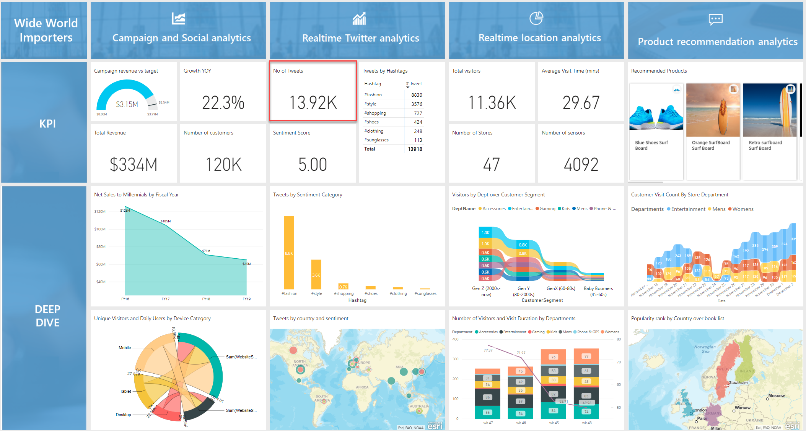

2. Select **Shopping** from **Tweets by Sentiment Category** and observe the changes on the map visual. 

> And in real-time, when you click on this, you can see which product categories are trending, what is working, and what isn’t. Which products have positive sentiment? 
> 
> But this is just Twitter.  Let’s go to one of the stores on the East coast, in Miami, Florida.

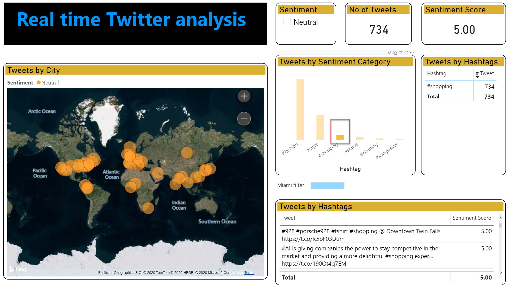

### Task 4: Retail Heat Map

1. [Click here to watch](media/New-Store-Simulation.avi) the heat map video. 

> I want to show you now this scenario that we worked on with a partner. Let’s say we’re all in the store in Miami.  We have customers in the store, walking in these aisles.  You can see that some areas are busier than others by the amount of red congregating in one place. 
> In real time, we can see that we have more people in the aisles with wines and wine glasses than these other sections where we have sunglasses.  

> Now let’s go and walk in the aisles of the store to see what’s happening. Let’s walk towards the wine section. We have IOT sensors all around us. 

> Guess what? We have eyeball sensors too
> that track eyeball movement for a more granular view of what is drawing the attention of customers.
> You can see that people are spending a lot of time looking here on the top right hand side – maybe this campaign and product placement is working!

### Task 5: Location Analytics 

1. Select **Total visitors** from **Realtime location analytics** pillar to access `Location Analytics` report.

> That was just one store in Miami, where we have 50 sensors. But on the East Coast we have 100 stores open, all with IoT sensors, all sending data in from 6-9am. That’s 5000 sensors sending data in real time. All this data gets processed in Synapse in real time. And now we can see total visitors, average visit time, how many sensors are active.

2. See **Visit to by store department**, then select long `visit_type` in the Entertainment department.

> Click on this and in real time I am able to capture how many people came through the store, but more exciting, I can see this by department.  
>
> In the entertainment department people are spending a long time.

3. Select short `visit_type` in the Mens department.

> They are spending less time in the men’s department. 

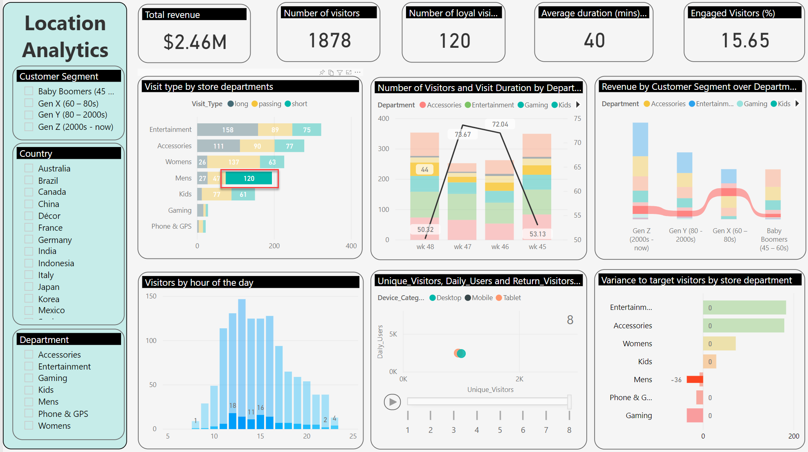

4. Select **Gen Y** in `Revenue by customer segment over department visual` and Hover over **Visitors by the hour of day** visual. 

> Now let’s focus on millennials.  We can see what time of the day they are visiting, and what devices they are using, in real time.
> 
> We can use this real-time customer feedback loop to make better decisions for the stores that will open after three hours on the West coast of the US.

5. Select **play** on a Scatter plot to see what devices are used by visitors.

### Task 6: Product Recommendation

1. Select **Recommended Products** from **Product recommendation analytics** pillar to access `Product Recommendations` report.

> It’s 9AM in Miami, and guess what time it is in San Diego, California? It’s 6AM.  We are about to open the store in San Diego.
> 
> Based on the learnings from the East coast, and the real time customer feedback loop, I can take better decisions for the San Diego store.
> 
> We can use the AI models that we showed to you earlier in Synapse. 

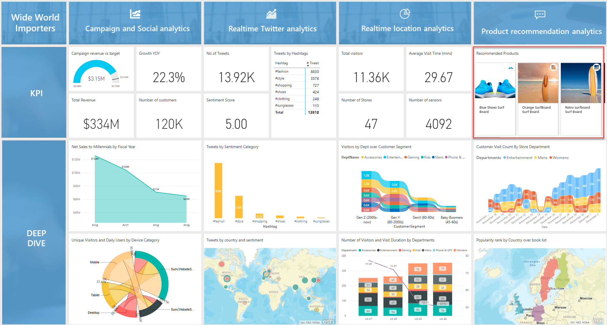

2. Select **Cocktail Glasses** in **Product Category** filter.

> Based on what happened in Miami, and using the AI model that we showed before, we can predict that if someone buys cocktail glasses, what other products will they buy? 

3. Select **Running Shoes** in **Product Category** filter.

> If they buy running shoes, what other products will they buy?

> We can’t change our inventory in San Diego with only three hours warning, but using all of this information, I can change product placement or use dynamic product pricing. 
>
> Using the Auto ML model, we can predict how many customers will visit the entertainment department for the rest of the day on Nov 29th, and from Nov 30 - Dec 2, and plan how many employees I should staff that department with. 

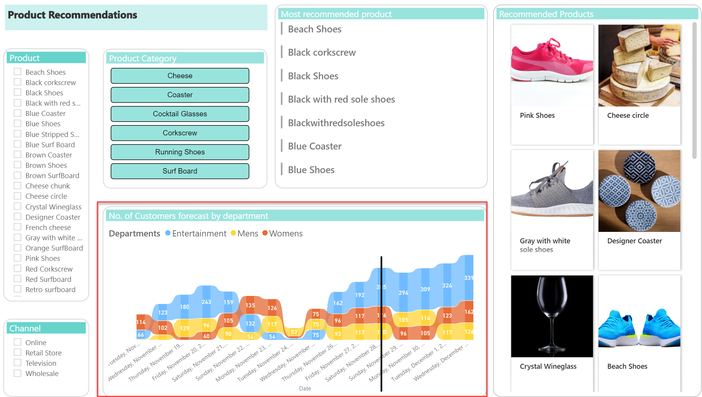

> It allows us to act quickly and take better decisions for all of our West coast stores.

