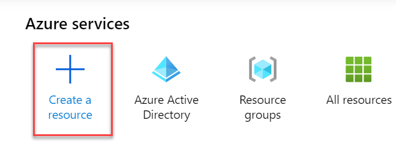
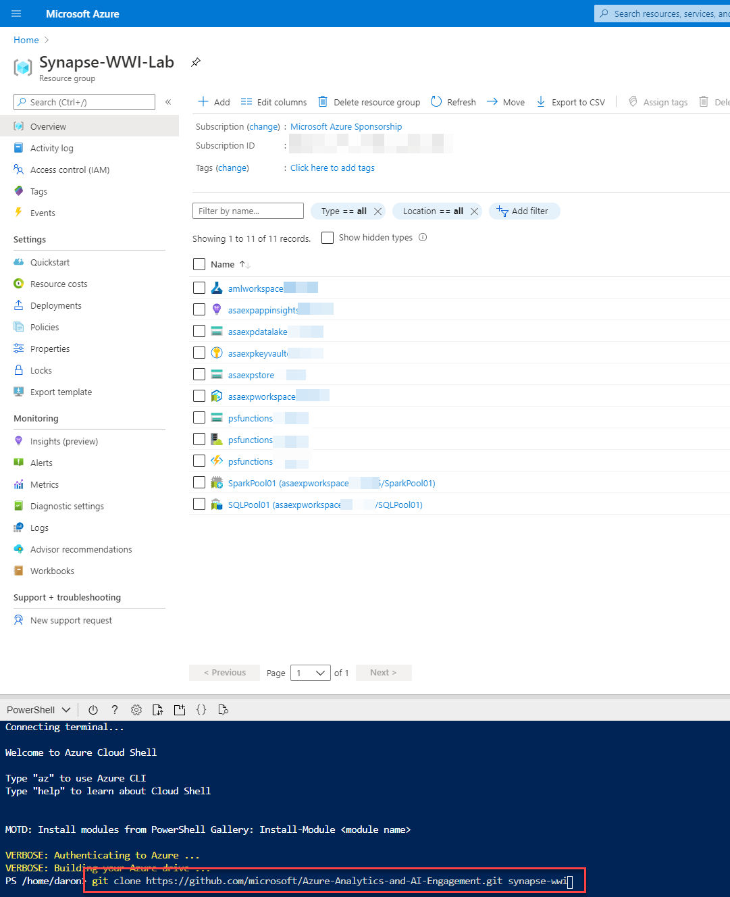
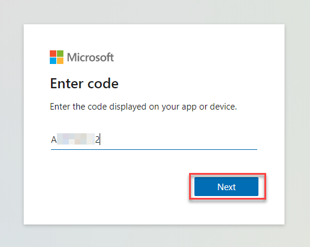
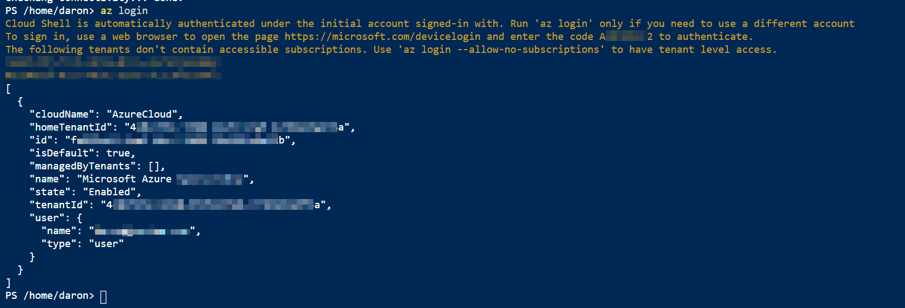
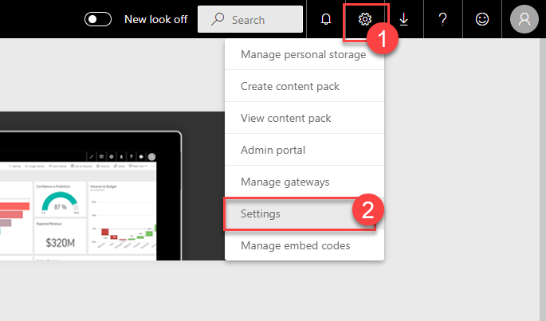
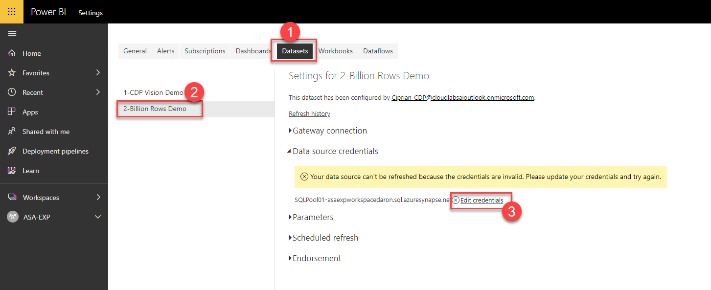

# Azure Synapse Analytics WWI Setup Guide

**Contents**

<!-- TOC -->

- [Azure Synapse Analytics WWI setup guide](#azure-synapse-analytics-wwi-setup-guide)
  - [Requirements](#requirements)
  - [Before Starting](#before-starting)
    - [Task 1: Create a resource group in Azure](#task-1-create-a-resource-group-in-azure)
    - [Task 2: Create Azure Synapse Analytics workspace](#task-2-create-azure-synapse-analytics-workspace)
    - [Task 3: Download artifacts](#task-3-download-artifacts)
    - [Task 4: Establish a user context](#task-4-establish-a-user-context)
    - [Task 5: Run environment setup PowerShell script](#task-5-run-environment-setup-powershell-script)

<!-- /TOC -->

## Requirements

1. An Azure Account with the ability to create an Azure Synapse Workspace
2. A PowerBI Pro or Premium account to host Power BI reports.

## Before starting

### Task 1: Create a resource group in Azure

1. Log into the [Azure Portal](https://portal.azure.com) using your Azure credentials.

2. On the Azure Portal home screen, select the **+ Create a resource** tile.

    

3. In the **Search the Marketplace** text box, type **Resource group** and press the **Enter** key.

    

4. Select the **Create** button on the **Resource group** overview page.

5. On the **Create a resource group** screen, select your desired Subscription and Region. For Resource group, enter **Synapse-WWI-Lab**, then select the **Review + Create** button.

    

6. Select the **Create** button once validation has passed.

### Task 2: Create Azure Synapse Analytics workspace

1. Deploy the workspace through the following Azure ARM template (press the button below):

    <a href="https://portal.azure.com/#create/Microsoft.Template/uri/https%3A%2F%2Fraw.githubusercontent.com%2Fmicrosoft%2FAzure-Analytics-and-AI-Engagement%2Fmain%2Fartifacts%2Fenvironment-setup%2Fautomation%2F00-asa-workspace-core.json" target="_blank"></a>

2. On the **Custom deployment** form, select your desired subscription and select **Synapse-WWI-Lab** for the **Resource group**. Also provide a **Unique Suffix**. Finally, provide a strong **SQL Administrator Login Password**. Remember this password value, you'll be needing it!

    
  
    > **Important**: The `location` field under 'Settings' will list the Azure regions where Azure Synapse Analytics (Preview) is available as of June 2020. This will help you find a region where the service is available without being limited to where the resource group is defined.

3. Check the **I agree to the terms and conditions stated above**, then select the **Purchase** button. The provisioning of your deployment resources will take approximately 10 minutes.

    > **Note**: You may experience a deployment step failing in regards to Role Assignment. This error may safely be ignored.

### Task 3: Download artifacts

1. In the Azure Portal, open the Azure Cloud Shell by selecting its icon from the right side of the top toolbar.

    

    > **Note**: If you are prompted to choose a shell, select **Powershell**, and if asked to create a storage account for the Cloud Shell, agree to have it created.

2. In the Cloud Shell window, enter the following command to clone the repository files.

    ```PowerShell
    git clone https://github.com/microsoft/Azure-Analytics-and-AI-Engagement.git synapse-wwi
    ```
    
    

3. Keep the Cloud Shell open.

### Task 4: Establish a user context

1. In the Cloud Shell, execute the following command:

    ```cli
    az login
    ```

2. A message will be displayed asking you to open a new tab in your web browser, navigate to [https://microsoft.com/devicelogin](https://microsoft.com/devicelogin) and enter the code you have been given for authentication.

   

   

3. Once complete, you may close the tab from the previous step and return to the Cloud Shell.

   

### Task 5: Run environment setup PowerShell script

When executing the script below, it is important to let the scripts run to completion. Some tasks may take longer than others to run. When a script completes execution, you will be returned to a command prompt. The total runtime of all steps in this task will take approximately 15 minutes.

1. In the Cloud Shell, change the current directory to the **automation** folder of the cloned repository by executing the following:

    ```PowerShell
    cd './synapse-wwi/artifacts/environment-setup/automation'
    ```

2. Execute the **01-environment-setup.ps1** script by executing the following command:

    ```PowerShell
    ./01-environment-setup.ps1
    ```

    You will be prompted to specify the size of the data you want to populate into the Sales table. You can either chose the small data size with 3 million records, or the large data size with 30 billion records. Choosing 30 billion records will have the script scale your SQL Pool to DW3000c during data transfer, which might take up to 4 hours. 
    
    
    
    You may be prompted to enter the name of your desired Azure Subscription. You can copy and paste the value from the list to select one.   

    You will also be prompted for the following information for this script:

    | Prompt |
    |--------|
    | Enter the SQL Administrator password you used in the deployment |

    

    You may be prompted to approve installations from PS-Gallery. Please approve to proceed with the automation.   

    
    
3. Sign in into the [Power BI Portal](https://powerbi.microsoft.com/en-us/) using your Azure credentials.

4. From the hamburger menu select **Workspaces** to access the list of workspaces available to you. Select the workspace named `asa-exp{suffix}`.


5. Select the **Settings** icon from the top right bar, and select **Settings** again to navigate to the settings page.



6. Select **datasets** tab to access the list of datasets available. Then select `2-Billion Rows Demo` dataset to access its settings. From the settings page open **Data source credentials** and select **Edit credentials**.



7. Select **OAuth2** for the **Authentication method** and select **Sign In** to complete the process.


You should follow all steps provided *before* performing proceeding to the following activities.
