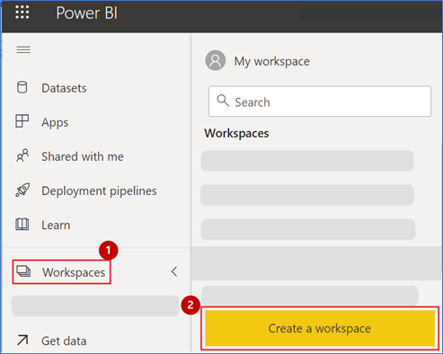
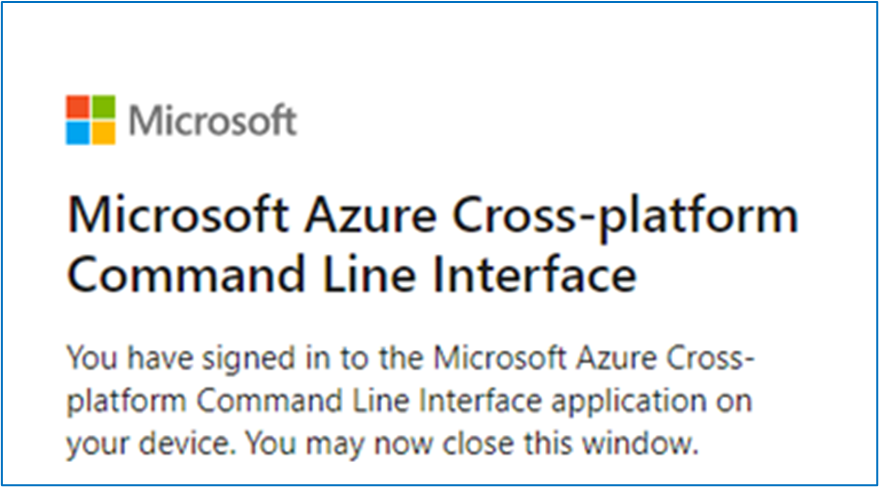
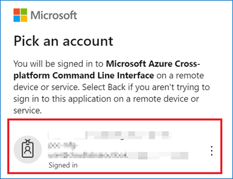

# Analytics in MIDP DREAM PoC Accelerator Setup Guide

## What is it?
DREAM PoC Accelerators (DPoC) are packaged Industry Scenario DREAM Demos with ARM templates (with a demo web app, Power BI reports, Synapse resources, AML Notebooks etc.) that can be deployed in a customer’s subscription using the CAPE tool in a few hours.  Partners can also deploy DREAM Demos in their own subscriptions using DPoC.

## Objective & Intent
Partners can deploy DREAM Demos in their own Azure subscriptions and show live demos to customers. 
In partnership with Microsoft sellers, partners can deploy the Industry scenario DREAM demos into customer subscriptions. 
Customers can play,  get hands-on experience navigating through the demo environment in their own subscription and show to their own stakeholders
**Before You Begin**

## :exclamation:IMPORTANT NOTES:  

  1. **Please read the [license agreement](https://github.com/microsoft/Azure-Analytics-and-AI-Engagement/blob/main/CDP-Retail/license.md) and [disclaimer](https://github.com/microsoft/Azure-Analytics-and-AI-Engagement/blob/main/CDP-Retail/disclaimer.md) before proceeding, as your access to and use of the code made available hereunder is subject to the terms and conditions made available therein.**
  2. Without limiting the terms of the [license](https://github.com/microsoft/Azure-Analytics-and-AI-Engagement/blob/main/CDP-Retail/license.md) , any Partner distribution of the Software (whether directly or indirectly) may only be made through Microsoft’s Customer Acceleration Portal for Engagements (“CAPE”). CAPE is accessible by Microsoft employees. For more information about the CAPE process, please connect with your local Data & AI specialist or CSA/GBB.
  3. Please note that **Azure hosting costs** are involved when DREAM PoC Accelerators are implemented in customer or partner Azure subscriptions. **Microsoft will not cover** DPoC hosting costs for partners or customers.
  4. Since this is a DPoC, there are certain resources open to the public. **Please ensure proper security practices are followed before you add any sensitive data into the environment.** To strengthen the security posture of the environment, **leverage Azure Security Centre.** 
  5.  For any questions or comments please email **[dreamdemos@microsoft.com](mailto:dreamdemos@microsoft.com).**
  
   > **Note**: Set up your demo environment at least two hours before your scheduled demo to make sure everything is working.
   
# Copyright

© 2021 Microsoft Corporation. All rights reserved.   

By using this demo/lab, you agree to the following terms: 

The technology/functionality described in this demo/lab is provided by Microsoft Corporation for purposes of obtaining your feedback and to provide you with a learning experience. You may only use the demo/lab to evaluate such technology features and functionality and provide feedback to Microsoft.  You may not use it for any other purpose. You may not modify, copy, distribute, transmit, display, perform, reproduce, publish, license, create derivative works from, transfer, or sell this demo/lab or any portion thereof. 

COPYING OR REPRODUCTION OF THE DEMO/LAB (OR ANY PORTION OF IT) TO ANY OTHER SERVER OR LOCATION FOR FURTHER REPRODUCTION OR REDISTRIBUTION IS EXPRESSLY PROHIBITED. 

THIS DEMO/LAB PROVIDES CERTAIN SOFTWARE TECHNOLOGY/PRODUCT FEATURES AND FUNCTIONALITY, INCLUDING POTENTIAL NEW FEATURES AND CONCEPTS, IN A SIMULATED ENVIRONMENT WITHOUT COMPLEX SET-UP OR INSTALLATION FOR THE PURPOSE DESCRIBED ABOVE. THE TECHNOLOGY/CONCEPTS REPRESENTED IN THIS DEMO/LAB MAY NOT REPRESENT FULL FEATURE FUNCTIONALITY AND MAY NOT WORK THE WAY A FINAL VERSION MAY WORK. WE ALSO MAY NOT RELEASE A FINAL VERSION OF SUCH FEATURES OR CONCEPTS.  YOUR EXPERIENCE WITH USING SUCH FEATURES AND FUNCITONALITY IN A PHYSICAL ENVIRONMENT MAY ALSO BE DIFFERENT.

## Contents

<!-- TOC -->

- [Requirements](#requirements)
- [Before Starting](#before-starting)
  - [Task 1: Power BI Workspace creation](#task-1-power-bi-workspace-creation)
  - [Task 2: Run the Cloud Shell to provision the demo resources](#task-2-run-the-cloud-shell-to-provision-the-demo-resources)

<!-- /TOC -->

## Requirements

* An Azure Account with the ability to create an Azure Synapse Workspace.
* A Power BI Pro or Premium account to host Power BI reports.
* Make sure you are the Power BI administrator for your account and service principal access is enabled on your Power BI tenant.
* Make sure the following resource providers are registered with your Azure Subscription.
   - Microsoft.Sql 
   - Microsoft.Synapse 
   - Microsoft.StreamAnalytics 
   - Microsoft.EventHub 
   - Microsoft.Media.MediaServices
   - Microsoft.Databricks
   - Microsoft.Kusto
   - Microsoft.Purview
* You can run only one deployment at any point in time and need to wait for its completion. You should not run multiple deployments in parallel as that will cause deployment failures.
* Select a region where the desired Azure Services are available. If certain services are not available, deployment may fail. See [Azure Services Global Availability](https://azure.microsoft.com/en-us/global-infrastructure/services/?products=all) for understanding target service availability. (consider the region availability for Synapse workspace, Iot Central and cognitive services while choosing a location)
* Do not use any special characters or uppercase letters in the environment code. Also, do not re-use your environment code.
* In this Accelerator we have converted Real-time reports into static reports for the ease of users but have covered entire process to configure Realtime dataset. Using those Realtime dataset you can create Realtime reports.
* Please ensure that you select the correct resource group name. We have given a sample name which may need to be changed should any resource group with the same name already exist in your subscription.
* The audience for this document is CSAs and GBBs.
* Please log in to Azure and Power BI using the same credentials.
* Once the resources have been setup, please ensure that your AD user and synapse workspace have “Storage Blob Data Owner” role assigned on storage account name starting with “storage”. You need to contact AD admin to get this done.
* Please review the [License Agreement](https://github.com/microsoft/Azure-Analytics-and-AI-Engagement/blob/main/CDP-Retail/license.md) before proceeding.

## Before starting


### Task 1: Power BI Workspace creation

1. **Open** Power BI in a new tab using the following link:  [https://app.powerbi.com/](https://app.powerbi.com/)

2. **Sign in**, to Power BI using your Power BI Pro account.

	

	> **Note:** Use the same credentials for Power BI which you will be using for the Azure account.

3. In Power BI service **Click** on 'Workspaces'.

4. Then **click** on the 'Create a workspace' tab.

	

	> **Note:** Please create a Workspace by the name "MIDP-dpoc".

5. **Copy** the Workspace GUID or ID. You can get this by browsing to [https://app.powerbi.com/](https://app.powerbi.com/), selecting the workspace, and then copying the GUID 	from the address URL.

6. **Paste** the GUID in a notepad for future reference.

	

	> **Note:** This workspace ID will be used during ARM template deployment.


### Task 2: Run the Cloud Shell to provision the demo resources

**Open** the Azure Portal.

1. In the Resource group section, **open** the Azure Cloud Shell by selecting its icon from the top toolbar.

	

2. **Click** on 'Show advanced settings'.

	

	> **Note:** If you already have a storage mounted for Cloud Shell, you will not get this prompt. In that case, skip step 2 and 3.

3. **Select** your 'Resource Group' and **enter** the 'Storage account' and 'File share' name.

	

	> **Note:** If you are creating a new storage account, give it a unique name with no special characters or uppercase letters.

4. In the Azure Cloud Shell window, ensure the PowerShell environment is selected and **enter** the following command to clone the repository files.
Command:
```
git clone -b analytics-in-midp --depth 1 --single-branch https://github.com/microsoft/Azure-Analytics-and-AI-Engagement.git midp
```


	
> **Note:** If you get File already exist error, please execute following command: rm midp -r -f to delete existing clone.

> **Note**: When executing scripts, it is important to let them run to completion. Some tasks may take longer than others to run. When a script completes execution, you will be returned to a command prompt. 

5. **Execute** the Powershell script by executing the following command:
Command:
```
cd ./midp/dpoc
```

6. Then **run** the PowerShell: 
```
./midpSetup.ps1
```
    

      
7. From the Azure Cloud Shell, **copy** the authentication code

8. Click on the link [https://microsoft.com/devicelogin](https://microsoft.com/devicelogin) and a new browser window will launch.

	
     
9. **Paste** the authentication code.

	

10. **Select** the same user that you used for signing in to the Azure Portal in [Task 1](#task-1-create-a-resource-group-in-azure).

	

11. **Close** the browser tab once you see the message window at right and **go back** to your Azure Cloud Shell execution window.

	
	
12. **Navigate back** to the resource group tab.

13. You will get another code to authenticate an Azure PowerShell script for creating reports in Power BI. **Copy** the code.

14. **Click** the link [https://microsoft.com/devicelogin](https://microsoft.com/devicelogin).

	

15. A new browser window will launch.

16. **Enter** the authentication code you copied from the shell above.

	

17. Again, **select** the same user to authenticate which you used for signing into the Azure Portal in [Task 1](#task-1-create-a-resource-group-in-azure).

	
	
18. **Close** the browser tab once you see the message window at right, and then go back to your Azure Cloud Shell execution window.

	

19. Now you will be prompted to select subscription if you have multiple subscription assigned to the user you used for device login.

    
	
	> **Notes:**
	> - The user with single subscription won't be prompted to select subscription.
	> - The subscription highlighted in yellow will be selected by default if you do not enter any disired subscription. Please select the subscription carefully, as it may break the execution further.
	> - While you are waiting for processes to get completed in the Azure Cloud Shell window, you'll be asked to enter the code three times. This is necessary for performing installation of various Azure Services and preloading content in the Azure Synapse Analytics SQL Pool tables.

20. You will now be prompted to **enter** the Region for deployment. Enter the region with necessary resources available. (ex. eastus,westus,westus2 etc)

	

20. You will now be prompted to **enter** the SQL Password and Power BI workspace id.

	

21. You will get another code to authenticate an Azure PowerShell script for creating reports in Power BI. **Copy** the code.
	> **Note:**
	> Note: You may see errors in script execution if you  do not have necessary permissions for cloudshell to manipulate your Power BI workspace. In such case follow this document [Power BI Embedding](https://github.com/microsoft/Azure-Analytics-and-AI-Engagement/blob/fintax/fintaxdemo/Power%20BI%20Embedding.md) to get the necessary permissions assigned. You’ll have to manually upload the reports to your Power BI workspace by downloading them from this location [Reports](https://github.com/microsoft/Azure-Analytics-and-AI-Engagement/tree/fintax/fintaxdemo/artifacts/reports). 

22. **Click** the link [https://microsoft.com/devicelogin](https://microsoft.com/devicelogin).

      
      
23. A new browser window will launch. **Paste** the code that you copied from the shell in step 21.

	

	> Note: Make sure to provide the device code before it expires and let the script run till completion.

24. **Select** the same user to authenticate which you used for signing into the Azure Portal in [Task 1](#task-1-create-a-resource-group-in-azure). 

	

25. **Close** the browser tab once you see the message window at right and go back to your Azure Cloud Shell execution window.

	

	> **Note:** The deployment will take approximately 50-55 minutes to complete. Keep checking the progress with messages printed in the console to avoid timeout.

26. After complete script has been executed, you get to see a messages "--Execution Complete--"
	
      
